# Shonkor Context Capsule

> [!NOTE]
> This context capsule was synthesized automatically by Shonkor.
> It contains a precise structural subgraph of the codebase relevant to your query.

## Subgraph Summary
- **Total Nodes:** 40
- **Total Edges:** 166

- **Node Composition:** Method: 9, File: 3, Class: 20, Record: 4, Interface: 3, Enum: 1

## Structural Architecture (Mermaid.js)

```mermaid
graph TD
    classDef file fill:#1d3557,stroke:#457b9d,stroke-width:2px,color:#fff;
    classDef classNode fill:#2a9d8f,stroke:#264653,stroke-width:2px,color:#fff;
    classDef methodNode fill:#9b5de5,stroke:#5c3d75,stroke-width:2px,color:#fff;
    classDef decision fill:#e76f51,stroke:#d62828,stroke-width:2px,color:#fff;
    classDef milestone fill:#f4a261,stroke:#e76f51,stroke-width:2px,color:#fff;
    classDef defaultNode fill:#6c757d,stroke:#495057,stroke-width:2px,color:#fff;

    n0["Method: ParseClassDeclarations"]
    class n0 methodNode;
    n1["File: RoslynAstParser.cs"]
    class n1 file;
    n2["Class: RoslynAstParser"]
    class n2 classNode;
    n3["File: RoslynSemantics.cs"]
    class n3 file;
    n4["Method: RoslynAstParser_AndLinker_ShouldResolveTypeUsageEdges"]
    class n4 methodNode;
    n5["Record: GraphNode"]
    class n5 classNode;
    n6["Class: SqliteGraphStorageProvider"]
    class n6 classNode;
    n7["Record: GraphEdge"]
    class n7 classNode;
    n8["File: shonkor-bug-report.md"]
    class n8 file;
    n9["Method: InitializeAsync"]
    class n9 methodNode;
    n10["Interface: IFileParser"]
    class n10 classNode;
    n11["Class: McpToolsTests"]
    class n11 classNode;
    n12["Method: ProcessJsonRpcMessageAsync"]
    class n12 methodNode;
    n13["Class: ParserAndStorageTests"]
    class n13 classNode;
    n14["Class: Program"]
    class n14 classNode;
    n15["Record: NodeTypeDescriptor"]
    class n15 classNode;
    n16["Method: SetupAsync"]
    class n16 methodNode;
    n17["Method: ToolCall"]
    class n17 methodNode;
    n18["Class: PhpModuleParser"]
    class n18 classNode;
    n19["Method: OpenConnectionAsync"]
    class n19 methodNode;
    n20["Class: CSharpDeclarationWalker"]
    class n20 classNode;
    n21["Class: ContextCapsuleSynthesizer"]
    class n21 classNode;
    n22["Enum: Provenance"]
    class n22 defaultNode;
    n23["Class: McpRequestHandler"]
    class n23 classNode;
    n24["Class: GraphIndexScanner"]
    class n24 classNode;
    n25["Class: McpSecurityTests"]
    class n25 classNode;
    n26["Class: ProjectManager"]
    class n26 classNode;
    n27["Class: ProvenanceIntegrityTests"]
    class n27 classNode;
    n28["Interface: IGraphView"]
    class n28 classNode;
    n29["Class: McpToolContext"]
    class n29 classNode;
    n30["Class: JavaScriptParser"]
    class n30 classNode;
    n31["Class: GraphPostProcessorTests"]
    class n31 classNode;
    n32["Interface: IGraphStorageProvider"]
    class n32 classNode;
    n33["Class: GraphQLParser"]
    class n33 classNode;
    n34["Class: MarkdownHierarchyParser"]
    class n34 classNode;
    n35["Record: GraphEnrichment"]
    class n35 classNode;
    n36["Class: SemanticCsharpLinkerTests"]
    class n36 classNode;
    n37["Method: ParseAsync"]
    class n37 methodNode;
    n38["Class: RoslynSemantics"]
    class n38 classNode;
    n39["Method: RunMcpServerAsync"]
    class n39 methodNode;

    n8 -->|REFERENCES| n1
    n8 -->|REFERENCES| n3
    n14 -->|CONTAINS| n39
    n14 -->|REFERENCES_TYPE| n10
    n14 -->|REFERENCES_TYPE| n32
    n14 -->|REFERENCES_TYPE| n21
    n14 -->|REFERENCES_TYPE| n33
    n14 -->|REFERENCES_TYPE| n30
    n14 -->|REFERENCES_TYPE| n34
    n14 -->|REFERENCES_TYPE| n18
    n14 -->|REFERENCES_TYPE| n2
    n14 -->|REFERENCES_TYPE| n24
    n14 -->|REFERENCES_TYPE| n23
    n14 -->|REFERENCES_TYPE| n26
    n14 -->|REFERENCES_TYPE| n6
    n39 -->|INSTANTIATES| n21
    n39 -->|INSTANTIATES| n33
    n39 -->|INSTANTIATES| n30
    n39 -->|INSTANTIATES| n34
    n39 -->|INSTANTIATES| n18
    n39 -->|INSTANTIATES| n2
    n10 -->|REFERENCES_TYPE| n7
    n10 -->|REFERENCES_TYPE| n5
    n10 -->|REFERENCES_TYPE| n15
    n10 -->|REFERENCES_TYPE| n22
    n28 -->|REFERENCES_TYPE| n7
    n28 -->|REFERENCES_TYPE| n5
    n7 -->|REFERENCES_TYPE| n22
    n35 -->|REFERENCES_TYPE| n7
    n35 -->|REFERENCES_TYPE| n5
    n21 -->|REFERENCES_TYPE| n7
    n21 -->|REFERENCES_TYPE| n5
    n33 -->|IMPLEMENTS| n10
    n33 -->|REFERENCES_TYPE| n10
    n33 -->|REFERENCES_TYPE| n7
    n33 -->|REFERENCES_TYPE| n5
    n33 -->|INSTANTIATES| n15
    n33 -->|REFERENCES_TYPE| n15
    n33 -->|REFERENCES_TYPE| n22
    n30 -->|IMPLEMENTS| n10
    n30 -->|REFERENCES_TYPE| n10
    n30 -->|REFERENCES_TYPE| n7
    n30 -->|REFERENCES_TYPE| n5
    n30 -->|INSTANTIATES| n15
    n30 -->|REFERENCES_TYPE| n15
    n30 -->|REFERENCES_TYPE| n22
    n34 -->|IMPLEMENTS| n10
    n34 -->|REFERENCES_TYPE| n10
    n34 -->|REFERENCES_TYPE| n7
    n34 -->|REFERENCES_TYPE| n5
    n34 -->|INSTANTIATES| n15
    n34 -->|REFERENCES_TYPE| n15
    n34 -->|REFERENCES_TYPE| n22
    n18 -->|IMPLEMENTS| n10
    n18 -->|REFERENCES_TYPE| n10
    n18 -->|REFERENCES_TYPE| n7
    n18 -->|REFERENCES_TYPE| n5
    n18 -->|INSTANTIATES| n15
    n18 -->|REFERENCES_TYPE| n15
    n18 -->|REFERENCES_TYPE| n22
    n18 -->|CONTAINS| n0
    n0 -->|INSTANTIATES| n7
    n0 -->|INSTANTIATES| n5
    n1 -->|CONTAINS| n2
    n1 -->|CONTAINS| n20
    n2 -->|IMPLEMENTS| n10
    n2 -->|REFERENCES_TYPE| n10
    n2 -->|REFERENCES_TYPE| n7
    n2 -->|REFERENCES_TYPE| n5
    n2 -->|INSTANTIATES| n15
    n2 -->|REFERENCES_TYPE| n15
    n2 -->|REFERENCES_TYPE| n20
    n2 -->|CONTAINS| n37
    n20 -->|REFERENCES_TYPE| n7
    n20 -->|REFERENCES_TYPE| n5
    n37 -->|INSTANTIATES| n20
    n3 -->|CONTAINS| n38
    n24 -->|REFERENCES_TYPE| n10
    n24 -->|REFERENCES_TYPE| n32
    n24 -->|REFERENCES_TYPE| n7
    n24 -->|REFERENCES_TYPE| n5
    n24 -->|REFERENCES_TYPE| n22
    n23 -->|REFERENCES_TYPE| n10
    n23 -->|REFERENCES_TYPE| n21
    n23 -->|CONTAINS| n12
    n23 -->|INSTANTIATES| n29
    n23 -->|REFERENCES_TYPE| n29
    n23 -->|REFERENCES_TYPE| n26
    n29 -->|REFERENCES_TYPE| n10
    n29 -->|REFERENCES_TYPE| n32
    n29 -->|REFERENCES_TYPE| n7
    n29 -->|REFERENCES_TYPE| n5
    n29 -->|REFERENCES_TYPE| n22
    n29 -->|REFERENCES_TYPE| n21
    n29 -->|REFERENCES_TYPE| n26
    n26 -->|REFERENCES_TYPE| n32
    n26 -->|REFERENCES_TYPE| n6
    n6 -->|IMPLEMENTS| n32
    n6 -->|REFERENCES_TYPE| n32
    n6 -->|REFERENCES_TYPE| n7
    n6 -->|REFERENCES_TYPE| n5
    n6 -->|REFERENCES_TYPE| n22
    n6 -->|CONTAINS| n9
    n6 -->|CONTAINS| n19
    n9 -->|CALLS| n19
    n31 -->|REFERENCES_TYPE| n7
    n31 -->|REFERENCES_TYPE| n35
    n31 -->|REFERENCES_TYPE| n5
    n31 -->|REFERENCES_TYPE| n22
    n31 -->|REFERENCES_TYPE| n6
    n25 -->|REFERENCES_TYPE| n10
    n25 -->|REFERENCES_TYPE| n5
    n25 -->|REFERENCES_TYPE| n21
    n25 -->|REFERENCES_TYPE| n2
    n25 -->|REFERENCES_TYPE| n23
    n25 -->|REFERENCES_TYPE| n29
    n25 -->|REFERENCES_TYPE| n26
    n25 -->|REFERENCES_TYPE| n6
    n11 -->|REFERENCES_TYPE| n10
    n11 -->|REFERENCES_TYPE| n7
    n11 -->|REFERENCES_TYPE| n5
    n11 -->|REFERENCES_TYPE| n22
    n11 -->|REFERENCES_TYPE| n21
    n11 -->|REFERENCES_TYPE| n2
    n11 -->|REFERENCES_TYPE| n24
    n11 -->|REFERENCES_TYPE| n23
    n11 -->|REFERENCES_TYPE| n26
    n11 -->|REFERENCES_TYPE| n6
    n11 -->|CONTAINS| n16
    n11 -->|CONTAINS| n17
    n16 -->|INSTANTIATES| n7
    n16 -->|INSTANTIATES| n5
    n16 -->|INSTANTIATES| n21
    n16 -->|CALLS| n9
    n13 -->|REFERENCES_TYPE| n10
    n13 -->|REFERENCES_TYPE| n7
    n13 -->|REFERENCES_TYPE| n5
    n13 -->|REFERENCES_TYPE| n22
    n13 -->|REFERENCES_TYPE| n33
    n13 -->|REFERENCES_TYPE| n30
    n13 -->|REFERENCES_TYPE| n34
    n13 -->|REFERENCES_TYPE| n18
    n13 -->|REFERENCES_TYPE| n2
    n13 -->|REFERENCES_TYPE| n24
    n13 -->|REFERENCES_TYPE| n6
    n13 -->|CONTAINS| n4
    n4 -->|INSTANTIATES| n2
    n4 -->|CALLS| n37
    n4 -->|INSTANTIATES| n6
    n4 -->|CALLS| n9
    n27 -->|REFERENCES_TYPE| n10
    n27 -->|REFERENCES_TYPE| n7
    n27 -->|REFERENCES_TYPE| n5
    n27 -->|REFERENCES_TYPE| n22
    n27 -->|REFERENCES_TYPE| n33
    n27 -->|REFERENCES_TYPE| n30
    n27 -->|REFERENCES_TYPE| n34
    n27 -->|REFERENCES_TYPE| n18
    n27 -->|REFERENCES_TYPE| n2
    n27 -->|REFERENCES_TYPE| n38
    n27 -->|REFERENCES_TYPE| n24
    n27 -->|REFERENCES_TYPE| n6
    n36 -->|REFERENCES_TYPE| n22
    n36 -->|REFERENCES_TYPE| n2
    n36 -->|REFERENCES_TYPE| n38
    n36 -->|REFERENCES_TYPE| n6
```


## Code & Content References

#### 🏷️ `Class`: **RoslynAstParser** (Lines 16-563) · `RoslynAstParser.cs` — 🎯 primary
`public sealed class RoslynAstParser : IFileParser`

```csharp
public sealed class RoslynAstParser : IFileParser
  public IReadOnlySet<string> SupportedExtensions;
  public IReadOnlyList<NodeTypeDescriptor> NodeTypeDescriptors;
  public Task<(IReadOnlyList<GraphNode> Nodes, IReadOnlyList<GraphEdge> Edges)> ParseAsync(string filePath, string content);
```

#### 🏷️ `Method`: **RoslynAstParser_AndLinker_ShouldResolveTypeUsageEdges** (Lines 327-372) · `ParserAndStorageTests.cs` — 🎯 primary
`public async Task RoslynAstParser_AndLinker_ShouldResolveTypeUsageEdges()`

```csharp
[Fact]
    public async Task RoslynAstParser_AndLinker_ShouldResolveTypeUsageEdges()
    {
        // Regression/feature test for type-reference impact edges:
        // a class that uses a type defined in another file must be linked to that type's
        // definition node via a REFERENCES_TYPE edge after the post-scan linker runs.
        var defParser = new RoslynAstParser();
        var defCode = """
            namespace Demo;
            public record GraphNode { public string Id { get; init; } = ""; }
            """;
        var (defNodes, defEdges) = await defParser.ParseAsync("GraphNode.cs", defCode);

        var useParser = new RoslynAstParser();
        var useCode = """
            namespace Demo;
            public class Repository
            {
                private GraphNode _cached;
                public GraphNode Get(GraphNode seed) => seed;
            }
            """;
        var (useNodes, useEdges) = await useParser.ParseAsync("Repository.cs", useCode);

        // The using type must carry the referenced type name for the linker to resolve.
        var repoType = useNodes.First(n => n.Type == "Class" && n.Name == "Repository");
        Assert.Contains("GraphNode", repoType.Properties["referencedTypes"].Split(','));

        using var storage = new SqliteGraphStorageProvider(":memory:");
        await storage.InitializeAsync();
        await storage.UpsertNodesAsync(defNodes.Concat(useNodes));
        await storage.UpsertEdgesAsync(defEdges.Concat(useEdges));

        // Act: run the post-scan linker that resolves type references into edges.
        await CrossTechLinker.EstablishCrossTechnologyConnectionsAsync(storage, "C:\\mock");

        // Assert: traversing out from the definition reaches its user via REFERENCES_TYPE.
        var (_, edges) = await storage.GetSubgraphAsync(new[] { "GraphNode.cs::Demo.GraphNode" }, 1);
        var refEdge = edges.FirstOrDefault(e =>
            e.Relationship == "REFERENCES_TYPE" &&
            e.SourceId == "Repository.cs::Demo.Repository" &&
            e.TargetId == "GraphNode.cs::Demo.GraphNode");
        Assert.NotNull(refEdge);
        // Name-based cross-tech resolution to a single definition is Inferred, never Extracted.
        Assert.Equal(Provenance.Inferred, refEdge.Provenance);
    }
```

#### 🏷️ `Method`: **ParseClassDeclarations** (Lines 112-143) · `PhpModuleParser.cs` — 🎯 primary
`private static void ParseClassDeclarations(string filePath, string content, List<GraphNode> nodes, List<GraphEdge> edges)`

```csharp
/// <summary>
    /// Detects PHP class declarations with <c>extends</c> clauses and creates
    /// <c>OxidModule</c> nodes with <c>EXTENDS</c> edges to the base class.
    /// </summary>
    private static void ParseClassDeclarations(
        string filePath,
        string content,
        List<GraphNode> nodes,
        List<GraphEdge> edges)
    {
        foreach (Match match in PhpClassExtendsPattern().Matches(content))
        {
            var className = match.Groups[1].Value;
            var baseClassName = match.Groups[2].Value;
            var classNodeId = $"{filePath}::{className}";

            nodes.Add(new GraphNode
            {
                Id = classNodeId,
                Name = className,
                Type = "OxidModule",
                FilePath = filePath,
                Properties = new Dictionary<string, string>
                {
                    ["baseClass"] = baseClassName
                }
            });

            edges.Add(new GraphEdge
            {
                SourceId = classNodeId,
                TargetId = baseClassName,
                Relationship = "EXTENDS"
            });
        }
    }
```

#### 🏷️ `File`: **RoslynAstParser.cs** · `RoslynAstParser.cs` — 🎯 primary

```csharp
using System.Collections.Frozen;

using Shonkor.Core.Interfaces;
using Shonkor.Core.Models;

using Microsoft.CodeAnalysis;
using Microsoft.CodeAnalysis.CSharp;
using Microsoft.CodeAnalysis.CSharp.Syntax;

namespace Shonkor.Core.Services;

/// <summary>
/// Parses C# source files using the Roslyn syntax tree API to extract
/// type declarations, method declarations, and inheritance relationships.
/// </summary>
public sealed class RoslynAstParser : IFileParser
{
    /// <inheritdoc />
    public IReadOnlySet<string> SupportedExtensions { get; } =
        new HashSet<string>(StringComparer.OrdinalIgnoreCase) { ".cs" }.ToFrozenSet();

    /// <inheritdoc />
    public IReadOnlyList<NodeTypeDescriptor> NodeTypeDescriptors { get; } = new[]
    {
        new NodeTypeDescriptor("Class", "Code", true),
        new NodeTypeDescriptor("Interface", "Code", true),
        new NodeTypeDescriptor("Record", "Code", true),
        new NodeTypeDescriptor("Method", "Code", true),
        new NodeTypeDescriptor("Enum", "Code", true),
        new NodeTypeDescriptor("Struct", "Code", true),
        new NodeTypeDescriptor("Property", "Code", false),
        new NodeTypeDescriptor("Constructor", "Code", false)
    };

    /// <inheritdoc />
    public Task<(IReadOnlyList<GraphNode> Nodes, IReadOnlyList<GraphEdge> Edges)> ParseAsync(
        string filePath,
        string content)
    {
        ArgumentException.ThrowIfNullOrWhiteSpace(filePath);
        ArgumentNullException.ThrowIfNull(content);

        var syntaxTree = CSharpSyntaxTree.ParseText(content);
        var root = syntaxTree.GetCompilationUnitRoot();

        var walker = new CSharpDeclarationWalker(filePath);
        walker.Visit(root);

        return Task.FromResult<(IReadOnlyList<GraphNode>, IReadOnlyList<GraphEdge>)>(
            (walker.Nodes.AsReadOnly(), walker.Edges.AsReadOnly()));
    }

    /// <summary>
    /// A <see cref="CSharpSyntaxWalker"/> that visits class, interface, record, and method declarations
    /// to build knowledge graph nodes and edges.
    /// </summary>
    private sealed class CSharpDeclarationWalker(string filePath) : CSharpSyntaxWalker
    {
        private const string ContainsRelationship = "CONTAINS";

        private string? _currentTypeNodeId;

        /// <summary>
        /// Gets the collected nodes from the syntax walk.
        /// </summary>
        public List<GraphNode> Nodes { get; } = [];

        /// <summary>
        /// Gets the collected edges from the syntax walk.
        /// </summary>
        public List<GraphEdge> Edges { get; } = [];

        /// <inheritdoc />
        public override void VisitClassDeclaration(ClassDeclarationSyntax node)
        {
            var typeNodeId = VisitTypeDeclaration(node, node.Identifier, node.BaseList, "Class", node.Modifiers);
            var prev = _currentTypeNodeId;
            _currentTypeNodeId = typeNodeId;
            base.VisitClassDeclaration(node);
            _currentTypeNodeId = prev;
        }

        /// <inheritdoc />
        public override void VisitInterfaceDeclaration(InterfaceDeclarationSyntax node)
        {
            var typeNodeId = VisitTypeDeclaration(node, node.Identifier, node.BaseList, "Interface", node.Modifiers);
            var prev = _currentTypeNodeId;
            _currentTypeNodeId = typeNodeId;
            base.VisitInterfaceDeclaration(node);
            _currentTypeNodeId = prev;
        }

        /// <inheritdoc />
        public override void VisitRecordDeclaration(RecordDeclarationSyntax node)
        {
            var typeNodeId = VisitTypeDeclaration(node, node.Identifier, node.BaseList, "Record", node.Modifiers);
            var prev = _currentTypeNodeId;
            _currentTypeNodeId = typeNodeId;
            base.VisitRecordDeclaration(node);
            _currentTypeNodeId = prev;
        }

        /// <inheritdoc />
        public override void VisitStructDeclaration(StructDeclarationSyntax node)
        {
            var typeNodeId = VisitTypeDeclaration(node, node.Identifier, node.BaseList, "Struct", node.Modifiers);
            var prev = _currentTypeNodeId;
            _currentTypeNodeId = typeNodeId;
            base.VisitStructDeclaration(node);
            _currentTypeNodeId = prev;
        }

        /// <inheritdoc />
        public override void VisitEnumDeclaration(EnumDeclarationSyntax node)
        {
            var typeName = node.Identifier.Text;
            var typeNodeId = CsharpNodeId.ForType(filePath, TypeChainOf(node));

            var members = string.Join(", ", node.Members.Select(m => m.Identifier.Text));
            var span = node.GetLocation().GetLineSpan();

            Nodes.Add(new GraphNode
            {
                Id = typeNodeId,
                Name = typeName,
                Type = "Enum",
                Content = $"Enum Members: {members}",
                FilePath = filePath,
                StartLine = span.StartLinePosition.Line + 1,
                EndLine = span.EndLinePosition.Line + 1,
                Properties = new Dictionary<string, string>
                {
                    ["modifiers"] = node.Modifiers.ToString(),
                    ["signature"] = Normalize($"{node.Modifiers} enum {typeName}")
                }
            });

            Edges.Add(new GraphEdge
            {
                SourceId = filePath,
                TargetId = typeNodeId,
                Relationship = ContainsRelationship
            });

            var prev = _currentTypeNodeId;
            _currentTypeNodeId = typeNodeId;
            base.VisitEnumDeclaration(node);
            _currentTypeNodeId = prev;
        }

        /// <inheritdoc />
        public override void VisitMethodDeclaration(MethodDeclarationSyntax node)
        {
            var methodName = node.Identifier.Text;
            var parentName = _currentTypeNodeId is not null ? _currentTypeNodeId.Split("::").Last() : "global";
            var arity = node.ParameterList.Parameters.Count;
            var methodNodeId = CsharpNodeId.ForMethod(filePath, parentName, methodName, arity, MethodOverloadSpan(node, methodName, arity));
            var span = node.GetLocation().GetLineSpan();

            Nodes.Add(new GraphNode
            {
                Id = methodNodeId,
                Name = methodName,
                Type = "Method",
                Content = GetFullContent(node),
                FilePath = filePath,
                StartLine = span.StartLinePosition.Line + 1,
                EndLine = span.EndLinePosition.Line + 1,
                Properties = new Dictionary<string, string>
                {
                    ["returnType"] = node.ReturnType.ToString(),
                    ["modifiers"] = node.Modifiers.ToString(),
                    ["parameters"] = node.ParameterList.Parameters.ToString(),
                    ["signature"] = MethodSignature(node)
                }
            });

            if (_currentTypeNodeId is not null)
            {
                Edges.Add(new GraphEdge
                {
                    SourceId = _currentTypeNodeId,
                    TargetId = methodNodeId,
                    Relationship = ContainsRelationship
                });
            }

            base.VisitMethodDeclaration(node);
        }

        /// <inheritdoc />
        public override void VisitPropertyDeclaration(PropertyDeclarationSyntax node)
        {
            var propertyName = node.Identifier.Text;
            var parentName = _currentTypeNodeId is not null ? _currentTypeNodeId.Split("::").Last() : "global";
            var propertyNodeId = CsharpNodeId.ForMember(filePath, parentName, propertyName);
            var span = node.GetLocation().GetLineSpan();

            Nodes.Add(new GraphNode
            {
                Id = propertyNodeId,
                Name = propertyName,
                Type = "Property",
                FilePath = filePath,
                StartLine = span.StartLinePosition.Line + 1,
                EndLine = span.EndLinePosition.Line + 1,
                Properties = new Dictionary<string, string>
                {
                    ["returnType"] = node.Type.ToString(),
                    ["modifiers"] = node.Modifiers.ToString(),
                    ["signature"] = PropertySignature(node)
                }
            });

            if (_currentTypeNodeId is not null)
            {
                Edges.Add(new GraphEdge
                {
                    SourceId = _currentTypeNodeId,
                    TargetId = propertyNodeId,
                    Relationship = ContainsRelationship
                });
            }

            base.VisitPropertyDeclaration(node);
        }

        /// <inheritdoc />
        public override void VisitConstructorDeclaration(ConstructorDeclarationSyntax node)
        {
            var constructorName = node.Identifier.Text;
            var parentName = _currentTypeNodeId is not null ? _currentTypeNodeId.Split("::").Last() : "global";
            var ctorArity = node.ParameterList.Parameters.Count;
            var constructorNodeId = CsharpNodeId.ForMethod(filePath, parentName, "Constructor", ctorArity, ConstructorOverloadSpan(node, ctorArity));
            var span = node.GetLocation().GetLineSpan();

            Nodes.Add(new GraphNode
            {
                Id = constructorNodeId,
                Name = constructorName,
                Type = "Constructor",
                Content = GetFullContent(node),
                FilePath = filePath,
                StartLine = span.StartLinePosition.Line + 1,
                EndLine = span.EndLinePosition.Line + 1,
                Properties = new Dictionary<string, string>
                {
                    ["modifiers"] = node.Modifiers.ToString(),
                    ["parameters"] = node.ParameterList.Parameters.ToString(),
                    ["signature"] = ConstructorSignature(node)
                }
            });

            if (_currentTypeNodeId is not null)
            {
                Edges.Add(new GraphEdge
                {
                    SourceId = _currentTypeNodeId,
                    TargetId = constructorNodeId,
                    Relationship = ContainsRelationship
                });
            }

            base.VisitConstructorDeclaration(node);
        }

        /// <summary>
        /// Returns the declaration's source offset when the enclosing type declares more than one method
        /// with the same name and arity (a same-arity overload group), so their node ids can be made
        /// distinct; otherwise <c>null</c> (the common, non-overloaded case keeps a stable name#arity id).
        /// The semantic linker derives the identical offset from the resolved symbol's declaring syntax.
        /// </summary>
        private static int? MethodOverloadSpan(MethodDeclarationSyntax node, string name, int arity)
        {
            if (node.Parent is not TypeDeclarationSyntax type) return null;
            var siblings = 0;
            foreach (var member in type.Members)
            {
                if (member is MethodDeclarationSyntax m
                    && m.Identifier.Text == name
                    && m.ParameterList.Parameters.Count == arity)
                {
                    siblings++;
                    if (siblings > 1) return node.Span.Start;
                }
            }
            return null;
        }

        /// <summary>Constructor counterpart of <see cref="MethodOverloadSpan"/> (overloads share the type's name, so only arity discriminates).</summary>
        private static int? ConstructorOverloadSpan(ConstructorDeclarationSyntax node, int arity)
        {
            if (node.Parent is not TypeDeclarationSyntax type) return null;
            var siblings = 0;
            foreach (var member in type.Members)
            {
                if (member is ConstructorDeclarationSyntax c
                    && c.ParameterList.Parameters.Count == arity)
                {
                    siblings++;
                    if (siblings > 1) return node.Span.Start;
                }
            }
            return null;
        }

        /// <summary>
        /// Shared logic for visiting class, interface, and record declarations.
        /// Creates a type node, a CONTAINS edge from the file, and inheritance edges for base types.
        /// </summary>
        private string VisitTypeDeclaration(
            TypeDeclarationSyntax node,
            SyntaxToken identifier,
            BaseListSyntax? baseList,
            string defaultType,
            SyntaxTokenList modifiers)
        {
            var typeName = identifier.Text;
            var typeNodeId = CsharpNodeId.ForType(filePath, TypeChainOf(node));

            // Collect the names of all types this declaration references (field/property/parameter/
            // return/object-creation/base types). These are resolved post-scan into REFERENCES_TYPE
            // edges by the linker, enabling "who uses type X?" impact traversal.
            var referencedTypes = CollectReferencedTypeNames(node, typeName);

            var signature = TypeSignature(modifiers, defaultType, identifier, node.TypeParameterList, baseList);
            var properties = new Dictionary<string, string>
            {
                ["modifiers"] = modifiers.ToString(),
                ["signature"] = signature
            };
            if (referencedTypes.Count > 0)
            {
                properties["referencedTypes"] = string.Join(",", referencedTypes);
            }

            var span = node.GetLocation().GetLineSpan();
            Nodes.Add(new GraphNode
            {
                Id = typeNodeId,
                Name = typeName,
                Type = defaultType,
                // Member-signature skeleton (TICKET-204): a class node otherwise stored no content, so FTS
                // and embeddings had nothing to match. Member bodies stay on their own nodes.
                Content = TypeSkeleton(node, signature),
                FilePath = filePath,
                StartLine = span.StartLinePosition.Line + 1,
                EndLine = span.EndLinePosition.Line + 1,
                Properties = properties
            });

            // Edge from file to type: CONTAINS
            Edges.Add(new GraphEdge
            {
                SourceId = filePath,
                TargetId = typeNodeId,
                Relationship = ContainsRelationship
            });

            // Edges for base types and implemented interfaces
            if (baseList is not null)
            {
                foreach (var baseType in baseList.Types)
                {
                    var baseTypeName = baseType.Type.ToString();
                    var relationship = IsLikelyInterface(baseTypeName) ? "IMPLEMENTS" : "EXTENDS";

                    Edges.Add(new GraphEdge
                    {
                        SourceId = typeNodeId,
                        TargetId = baseTypeName,
                        Relationship = relationship
                    });
                }
            }

            return typeNodeId;
        }

        /// <summary>
        /// Collects the distinct simple names of all types referenced within a type declaration
        /// (base types, field/property types, method return &amp; parameter types, local declarations,
        /// object creations, and generic type arguments), excluding the declaring type itself.
        /// Nested type declarations are not descended into (they collect their own references).
        /// </summary>
        private static List<string> CollectReferencedTypeNames(TypeDeclarationSyntax declaration, string selfName)
        {
            var names = new HashSet<string>(StringComparer.Ordinal);

            // Base types / implemented interfaces.
            if (declaration.BaseList is not null)
            {
                foreach (var baseType in declaration.BaseList.Types)
                {
                    CollectFromTypeSyntax(baseType.Type, names);
                }
            }

            // Walk members but do not descend into nested type declarations.
            foreach (var descendant in declaration.DescendantNodes(
                         n => !(n is TypeDeclarationSyntax tds && tds != declaration)))
            {
                switch (descendant)
                {
                    case PropertyDeclarationSyntax p:
                        CollectFromTypeSyntax(p.Type, names);
                        break;
                    case FieldDeclarationSyntax f:
                        CollectFromTypeSyntax(f.Declaration.Type, names);
                        break;
                    case MethodDeclarationSyntax m:
                        CollectFromTypeSyntax(m.ReturnType, names);
                        break;
                    case ParameterSyntax pa when pa.Type is not null:
                        CollectFromTypeSyntax(pa.Type, names);
                        break;
                    case ObjectCreationExpressionSyntax oc:
                        CollectFromTypeSyntax(oc.Type, names);
                        break;
                    case VariableDeclarationSyntax v:
                        CollectFromTypeSyntax(v.Type, names);
                        break;
                }
            }

            names.Remove(selfName);
            return names.ToList();
        }

        /// <summary>
        /// Extracts the simple type name(s) from a <see cref="TypeSyntax"/>, recursing through
        /// nullable/array/pointer/tuple wrappers and generic type arguments. Predefined types
        /// (int, string, …) and <c>var</c>/<c>void</c> are ignored.
        /// </summary>
        private static void CollectFromTypeSyntax(TypeSyntax? type, HashSet<string> acc)
        {
            switch (type)
            {
                case null:
                case PredefinedTypeSyntax:
                    break;
                case IdentifierNameSyntax id:
                    var name = id.Identifier.Text;
                    if (name is not ("var" or "void"))
                    {
                        acc.Add(name);
                    }
                    break;
                case QualifiedNameSyntax q:
                    CollectFromTypeSyntax(q.Right, acc);
                    break;
                case AliasQualifiedNameSyntax a:
                    CollectFromTypeSyntax(a.Name, acc);
                    break;
                case GenericNameSyntax g:
                    acc.Add(g.Identifier.Text);
                    foreach (var arg in g.TypeArgumentList.Arguments)
                    {
                        CollectFromTypeSyntax(arg, acc);
                    }
                    break;
                case NullableTypeSyntax n:
                    CollectFromTypeSyntax(n.ElementType, acc);
                    break;
                case ArrayTypeSyntax ar:
                    CollectFromTypeSyntax(ar.ElementType, acc);
                    break;
                case PointerTypeSyntax p:
                    CollectFromTypeSyntax(p.ElementType, acc);
                    break;
                case TupleTypeSyntax tup:
                    foreach (var el in tup.Elements)
                    {
                        CollectFromTypeSyntax(el.Type, acc);
                    }
                    break;
            }
        }

        /// <summary>The full source of a member (TICKET-204). Bounding for embeddings is <see cref="EmbeddingTextBuilder"/>'s
        /// job, not the parser's — a truncated body kills FTS on the second half and shrinks the get_source result.</summary>
        private static string GetFullContent(SyntaxNode node) => node.ToFullString().Trim();

        private static string Normalize(string s) =>
            string.Join(' ', s.Split((char[]?)null, StringSplitOptions.RemoveEmptyEntries));

        /// <summary>Signature of a method: <c>modifiers returnType Name(paramList)</c>.</summary>
        private static string MethodSignature(MethodDeclarationSyntax node) =>
            Normalize($"{node.Modifiers} {node.ReturnType} {node.Identifier.Text}{node.TypeParameterList}({node.ParameterList.Parameters})");

        /// <summary>Signature of a constructor: <c>modifiers Name(paramList)</c>.</summary>
        private static string ConstructorSignature(ConstructorDeclarationSyntax node) =>
            Normalize($"{node.Modifiers} {node.Identifier.Text}({node.ParameterList.Parameters})");

        /// <summary>Signature of a property: <c>modifiers type Name</c>.</summary>
        private static string PropertySignature(PropertyDeclarationSyntax node) =>
            Normalize($"{node.Modifiers} {node.Type} {node.Identifier.Text}");

        /// <summary>Signature of a type: <c>modifiers kind Name&lt;T&gt; : bases</c>.</summary>
        private static string TypeSignature(SyntaxTokenList modifiers, string kind, SyntaxToken identifier, TypeParameterListSyntax? typeParams, BaseListSyntax? baseList) =>
            Normalize($"{modifiers} {kind.ToLowerInvariant()} {identifier.Text}{typeParams} {baseList}");

        /// <summary>
        /// A member-signature skeleton for a type node's <c>Content</c> (TICKET-204): the type's own signature
        /// plus a one-line signature for each declared method/constructor/property — so FTS and embeddings have
        /// something to match on a class node (which otherwise stored no content), without its members' bodies.
        /// </summary>
        private static string TypeSkeleton(TypeDeclarationSyntax node, string typeSignature)
        {
            var sb = new System.Text.StringBuilder();
            sb.Append(typeSignature).Append('\n');
            foreach (var member in node.Members)
            {
                var line = member switch
                {
                    MethodDeclarationSyntax m => MethodSignature(m),
                    ConstructorDeclarationSyntax c => ConstructorSignature(c),
                    PropertyDeclarationSyntax p => PropertySignature(p),
                    _ => null
                };
                if (line is not null) sb.Append("  ").Append(line).Append(";\n");
            }
            return sb.ToString().TrimEnd();
        }

        /// <summary>
        /// Uses a naming convention heuristic to determine if a base type name refers to an interface.
        /// Interface names conventionally start with 'I' followed by an uppercase letter.
        /// </summary>
        private static bool IsLikelyInterface(string typeName) =>
            typeName.Length >= 2 && typeName[0] == 'I' && char.IsUpper(typeName[1]);

        /// <summary>
        /// Builds the type's full chain within its file — <c>{Namespace}.{Outer}+{Nested}</c> with a
        /// CLR-style backtick arity suffix on generic types — by walking the declaration's ancestors.
        /// <see cref="RoslynSemantics"/> derives the identical chain from the resolved symbol
        /// (<c>MetadataName</c> per segment), so syntactic and semantic node ids match.
        /// </summary>
        private static string TypeChainOf(BaseTypeDeclarationSyntax node)
        {
            var segments = new List<string>();
            var namespaces = new List<string>();
            for (SyntaxNode? current = node; current != null; current = current.Parent)
            {
                switch (current)
                {
                    case TypeDeclarationSyntax t:
                        var arity = t.TypeParameterList?.Parameters.Count ?? 0;
                        segments.Insert(0, arity > 0 ? $"{t.Identifier.Text}`{arity}" : t.Identifier.Text);
                        break;
                    case EnumDeclarationSyntax e:
                        segments.Insert(0, e.Identifier.Text);
                        break;
                    case BaseNamespaceDeclarationSyntax ns:
                        namespaces.Insert(0, ns.Name.ToString());
                        break;
                }
            }
            var chain = string.Join("+", segments);
            return namespaces.Count > 0 ? $"{string.Join(".", namespaces)}.{chain}" : chain;
        }
    }
}
```

#### 🏷️ `File`: **RoslynSemantics.cs** · `RoslynSemantics.cs` — 🎯 primary

```csharp
// Licensed to Shonkor under the MIT License.

using Microsoft.CodeAnalysis;
using Microsoft.CodeAnalysis.CSharp;

namespace Shonkor.Core.Services;

/// <summary>
/// Semantic-core foundation (spike): builds a <see cref="CSharpCompilation"/> over a set of source files
/// and maps a resolved Roslyn <see cref="ISymbol"/> back to a Shonkor graph node id. The future
/// <c>SemanticCsharpLinker</c> uses these primitives to emit exact <c>REFERENCES_TYPE</c>/<c>IMPLEMENTS</c>/
/// <c>EXTENDS</c>/<c>CALLS</c> edges (to node ids, not names). See docs/projects/semantic-csharp-core.md.
/// </summary>
public static class RoslynSemantics
{
    /// <summary>
    /// Builds a compilation over the given <c>(path, code)</c> files using the host's reference assemblies
    /// (R1: the trusted-platform-assemblies list — no build, no NuGet restore). Intra-codebase symbols
    /// resolve because their sources are in the syntax trees; symbols in un-referenced third-party
    /// assemblies stay unresolved (and have no node anyway). The <c>path</c> sets each tree's FilePath,
    /// which <see cref="ToNodeId"/> relies on.
    /// </summary>
    public static CSharpCompilation BuildCompilation(IEnumerable<(string Path, string Code)> files)
    {
        ArgumentNullException.ThrowIfNull(files);

        var trees = files.Select(f => CSharpSyntaxTree.ParseText(f.Code, path: f.Path));
        return BuildCompilationFromTrees(trees);
    }

    /// <summary>Builds a compilation from already-parsed syntax trees (used by the incremental compilation cache).</summary>
    public static CSharpCompilation BuildCompilationFromTrees(IEnumerable<SyntaxTree> trees)
    {
        ArgumentNullException.ThrowIfNull(trees);
        return CSharpCompilation.Create(
            "ShonkorSemantic",
            trees,
            ReferenceAssemblies(),
            new CSharpCompilationOptions(OutputKind.DynamicallyLinkedLibrary));
    }

    /// <summary>The host's reference assemblies (TPA list), used as compilation references without a build.</summary>
    public static IReadOnlyList<MetadataReference> ReferenceAssemblies()
    {
        var tpa = AppContext.GetData("TRUSTED_PLATFORM_ASSEMBLIES") as string ?? string.Empty;
        return tpa
            .Split(Path.PathSeparator, StringSplitOptions.RemoveEmptyEntries)
            .Where(File.Exists)
            .Select(p => (MetadataReference)MetadataReference.CreateFromFile(p))
            .ToList();
    }

    /// <summary>
    /// Maps a resolved symbol to its Shonkor node id (matching <see cref="CsharpNodeId"/>), or <c>null</c>
    /// when the symbol is external (declared only in metadata, e.g. <c>System.String</c>) and therefore
    /// has no node. Uses the symbol's first declaring syntax reference for the file path.
    /// </summary>
    public static string? ToNodeId(ISymbol? symbol)
    {
        if (symbol is null) return null;

        // An extension method invoked with member syntax (`a.Foo()`) resolves to the REDUCED symbol, whose
        // Parameters exclude the `this` parameter. The syntactic parser, however, counted `this` in the
        // method's arity. Use the original (unreduced) method so the arity — and thus the node id — match.
        if (symbol is IMethodSymbol { ReducedFrom: { } original }) symbol = original;

        var file = symbol.DeclaringSyntaxReferences.FirstOrDefault()?.SyntaxTree.FilePath;
        if (string.IsNullOrEmpty(file)) return null; // external / metadata-only symbol

        return symbol switch
        {
            INamedTypeSymbol type => CsharpNodeId.ForType(file, TypeChain(type)),
            // Primary constructors (records / primary-ctor classes) have no ConstructorDeclarationSyntax,
            // so the syntactic parser creates no node for them — mapping one to an id would emit a
            // dangling edge. Skip them; explicit constructors resolve normally.
            IMethodSymbol { MethodKind: MethodKind.Constructor } ctor when ctor.ContainingType is not null
                => IsExplicitConstructor(ctor)
                    ? CsharpNodeId.ForMethod(file, TypeChain(ctor.ContainingType), "Constructor", ctor.Parameters.Length, OverloadSpan(ctor))
                    : null,
            IMethodSymbol method when method.ContainingType is not null
                => CsharpNodeId.ForMethod(file, TypeChain(method.ContainingType), method.Name, method.Parameters.Length, OverloadSpan(method)),
            IPropertySymbol prop when prop.ContainingType is not null
                => CsharpNodeId.ForMember(file, TypeChain(prop.ContainingType), prop.Name),
            _ => null
        };
    }

    /// <summary>
    /// The symbol-side counterpart of the parser's <c>TypeChainOf</c>: the type's full chain
    /// (<c>{Namespace}.{Outer}+{Nested}</c>, generic arity via <see cref="ISymbol.MetadataName"/>'s
    /// backtick suffix). Both sides derive the chain from the same declaration structure, so ids match.
    /// </summary>
    private static string TypeChain(INamedTypeSymbol type)
    {
        var segments = new List<string>();
        for (var t = type; t is not null; t = t.ContainingType)
        {
            segments.Insert(0, t.MetadataName);
        }
        var chain = string.Join("+", segments);
        return type.ContainingNamespace is { IsGlobalNamespace: false } ns
            ? $"{ns.ToDisplayString()}.{chain}"
            : chain;
    }

    /// <summary>True when the constructor symbol is declared by an explicit <c>ConstructorDeclarationSyntax</c> (not a primary constructor).</summary>
    private static bool IsExplicitConstructor(IMethodSymbol ctor) =>
        ctor.DeclaringSyntaxReferences.Any(r => r.GetSyntax() is Microsoft.CodeAnalysis.CSharp.Syntax.ConstructorDeclarationSyntax);

    /// <summary>
    /// Returns the declaration's source offset when <paramref name="method"/> has a same-kind, same-arity
    /// overload sibling in its containing type — mirroring the parser's <c>MethodOverloadSpan</c> so node
    /// and edge ids match. Returns <c>null</c> for non-overloaded methods (stable name#arity id).
    /// </summary>
    private static int? OverloadSpan(IMethodSymbol method)
    {
        // Primary constructors are invisible to the syntactic parser (no ConstructorDeclarationSyntax),
        // so they must not count as overload siblings either — otherwise the explicit ctor's id would
        // gain a @span suffix the parser never emits.
        var siblings = method.ContainingType
            .GetMembers(method.Name)
            .OfType<IMethodSymbol>()
            .Count(m => m.MethodKind == method.MethodKind
                        && m.Parameters.Length == method.Parameters.Length
                        && (m.MethodKind != MethodKind.Constructor || IsExplicitConstructor(m)));

        if (siblings <= 1) return null;

        var span = method.DeclaringSyntaxReferences.FirstOrDefault()?.Span;
        return span?.Start;
    }
}
```

#### 🏷️ `Interface`: **IFileParser** (Lines 17-66) · `IFileParser.cs`
`public interface IFileParser`

```csharp
public interface IFileParser
  IReadOnlySet<string> SupportedExtensions;
  Provenance DefaultProvenance;
  IReadOnlyList<NodeTypeDescriptor> NodeTypeDescriptors;
  Task<(IReadOnlyList<GraphNode> Nodes, IReadOnlyList<GraphEdge> Edges)> ParseAsync(string filePath, string content);
```

#### 🏷️ `Record`: **GraphEdge** (Lines 6-24) · `GraphEdge.cs`
`public record GraphEdge`

```csharp
public record GraphEdge
  public string SourceId;
  public string TargetId;
  public string Relationship;
  public Provenance Provenance;
  public Dictionary<string, string> Properties;
```

#### 🏷️ `Record`: **GraphNode** (Lines 8-40) · `GraphNode.cs`
`public record GraphNode`

```csharp
public record GraphNode
  public string Id;
  public string Type;
  public string Name;
  public string Content;
  public string? FilePath;
  public int? StartLine;
  public int? EndLine;
  public string? ContentHash;
  public string? Summary;
  public float[]? Embedding;
  public Dictionary<string, string> Properties;
```

#### 🏷️ `Class`: **SqliteGraphStorageProvider** (Lines 20-1642) · `SqliteGraphStorageProvider.cs`
`public sealed class SqliteGraphStorageProvider : IGraphStorageProvider, IDisposable`

_(body omitted — context budget reached; 5837 chars. Fetch on demand via `get_source`.)_

#### 🏷️ `Enum`: **Provenance** (Lines 11-30) · `Provenance.cs`
`public enum Provenance`

```csharp
Enum Members: Extracted, Inferred, Ambiguous
```

#### 🏷️ `Class`: **Program** (Lines 14-820) · `Program.cs`
`public static class Program`

_(body omitted — context budget reached; 837 chars. Fetch on demand via `get_source`.)_

#### 🏷️ `Class`: **PhpModuleParser** (Lines 14-246) · `PhpModuleParser.cs`
`public sealed partial class PhpModuleParser : IFileParser`

_(body omitted — context budget reached; 1097 chars. Fetch on demand via `get_source`.)_

#### 🏷️ `Class`: **McpToolsTests** (Lines 17-938) · `McpToolsTests.cs`
`public class McpToolsTests`

_(body omitted — context budget reached; 3029 chars. Fetch on demand via `get_source`.)_

#### 🏷️ `Class`: **ParserAndStorageTests** (Lines 11-1181) · `ParserAndStorageTests.cs`
`public class ParserAndStorageTests`

_(body omitted — context budget reached; 2373 chars. Fetch on demand via `get_source`.)_

#### 🏷️ `Class`: **ProvenanceIntegrityTests** (Lines 16-216) · `ProvenanceIntegrityTests.cs`
`public class ProvenanceIntegrityTests`

_(body omitted — context budget reached; 657 chars. Fetch on demand via `get_source`.)_

#### 🏷️ `Record`: **NodeTypeDescriptor** (Lines 3-7) · `NodeTypeDescriptor.cs`
`public record NodeTypeDescriptor`

```csharp
public record NodeTypeDescriptor
```

#### 🏷️ `Class`: **GraphQLParser** (Lines 12-165) · `GraphQLParser.cs`
`public sealed partial class GraphQLParser : IFileParser`

_(body omitted — context budget reached; 529 chars. Fetch on demand via `get_source`.)_

#### 🏷️ `Class`: **JavaScriptParser** (Lines 20-180) · `JavaScriptParser.cs`
`public sealed class JavaScriptParser : IFileParser`

_(body omitted — context budget reached; 526 chars. Fetch on demand via `get_source`.)_

#### 🏷️ `Class`: **MarkdownHierarchyParser** (Lines 13-314) · `MarkdownHierarchyParser.cs`
`public sealed partial class MarkdownHierarchyParser : IFileParser`

_(body omitted — context budget reached; 958 chars. Fetch on demand via `get_source`.)_

#### 🏷️ `Class`: **McpToolContext** (Lines 17-290) · `McpToolContext.cs`
`public sealed class McpToolContext`

_(body omitted — context budget reached; 1775 chars. Fetch on demand via `get_source`.)_

#### 🏷️ `Class`: **ContextCapsuleSynthesizer** (Lines 12-331) · `ContextCapsuleSynthesizer.cs`
`public sealed class ContextCapsuleSynthesizer`

_(body omitted — context budget reached; 478 chars. Fetch on demand via `get_source`.)_

#### 🏷️ `Class`: **GraphIndexScanner** (Lines 17-781) · `GraphIndexScanner.cs`
`public sealed class GraphIndexScanner`

_(body omitted — context budget reached; 2411 chars. Fetch on demand via `get_source`.)_

#### 🏷️ `Class`: **McpRequestHandler** (Lines 19-261) · `McpRequestHandler.cs`
`public sealed class McpRequestHandler`

_(body omitted — context budget reached; 796 chars. Fetch on demand via `get_source`.)_

#### 🏷️ `Class`: **McpSecurityTests** (Lines 18-241) · `McpSecurityTests.cs`
`public class McpSecurityTests`

_(body omitted — context budget reached; 1039 chars. Fetch on demand via `get_source`.)_

#### 🏷️ `Method`: **RunMcpServerAsync** (Lines 626-707) · `Program.cs`
`private static async Task<int> RunMcpServerAsync(string[] args)`

_(body omitted — context budget reached; 4388 chars. Fetch on demand via `get_source`.)_

#### 🏷️ `Class`: **ProjectManager** (Lines 81-640) · `ProjectManager.cs`
`public partial class ProjectManager`

_(body omitted — context budget reached; 1430 chars. Fetch on demand via `get_source`.)_

#### 🏷️ `Interface`: **IGraphStorageProvider** (Lines 15-17) · `IGraphStorageProvider.cs`
`public interface IGraphStorageProvider : IGraphStore, IGraphSearch, ISemanticGraphStore, IDiagnosticStore`

_(body omitted — context budget reached; 105 chars. Fetch on demand via `get_source`.)_

#### 🏷️ `Class`: **CSharpDeclarationWalker** (Lines 57-562) · `RoslynAstParser.cs`
`private sealed class CSharpDeclarationWalker : CSharpSyntaxWalker`

_(body omitted — context budget reached; 2016 chars. Fetch on demand via `get_source`.)_

#### 🏷️ `Class`: **GraphPostProcessorTests** (Lines 14-246) · `GraphPostProcessorTests.cs`
`public class GraphPostProcessorTests`

_(body omitted — context budget reached; 927 chars. Fetch on demand via `get_source`.)_

#### 🏷️ `Method`: **SetupAsync** (Lines 19-82) · `McpToolsTests.cs`
`private static async Task<(ProjectManager Pm, ContextCapsuleSynthesizer Synth, string Workspace)> SetupAsync()`

_(body omitted — context budget reached; 6661 chars. Fetch on demand via `get_source`.)_

#### 🏷️ `Method`: **InitializeAsync** (Lines 87-91) · `SqliteGraphStorageProvider.cs`
`public async Task InitializeAsync(CancellationToken cancellationToken = default)`

_(body omitted — context budget reached; 333 chars. Fetch on demand via `get_source`.)_

#### 🏷️ `Class`: **SemanticCsharpLinkerTests** (Lines 14-227) · `SemanticCsharpLinkerTests.cs`
`public class SemanticCsharpLinkerTests`

_(body omitted — context budget reached; 972 chars. Fetch on demand via `get_source`.)_

#### 🏷️ `Record`: **GraphEnrichment** (Lines 13-20) · `GraphEnrichment.cs`
`public record GraphEnrichment`

_(body omitted — context budget reached; 68 chars. Fetch on demand via `get_source`.)_

#### 🏷️ `Method`: **ParseAsync** (Lines 36-51) · `RoslynAstParser.cs`
`public Task<(IReadOnlyList<GraphNode> Nodes, IReadOnlyList<GraphEdge> Edges)> ParseAsync(string filePath, string content)`

_(body omitted — context budget reached; 666 chars. Fetch on demand via `get_source`.)_

#### 🏷️ `Class`: **RoslynSemantics** (Lines 14-132) · `RoslynSemantics.cs`
`public static class RoslynSemantics`

_(body omitted — context budget reached; 530 chars. Fetch on demand via `get_source`.)_

#### 🏷️ `File`: **shonkor-bug-report.md** · `shonkor-bug-report.md`

_(body omitted — context budget reached; 49588 chars. Fetch on demand via `get_source`.)_

#### 🏷️ `Interface`: **IGraphView** (Lines 13-36) · `IGraphView.cs`
`public interface IGraphView`

_(body omitted — context budget reached; 690 chars. Fetch on demand via `get_source`.)_

#### 🏷️ `Method`: **OpenConnectionAsync** (Lines 71-84) · `SqliteGraphStorageProvider.cs`
`private async Task<SqliteConnection> OpenConnectionAsync(CancellationToken cancellationToken)`

_(body omitted — context budget reached; 747 chars. Fetch on demand via `get_source`.)_

#### 🏷️ `Method`: **ProcessJsonRpcMessageAsync** (Lines 117-208) · `McpRequestHandler.cs`
`public async Task<string?> ProcessJsonRpcMessageAsync(string json)`

_(body omitted — context budget reached; 4723 chars. Fetch on demand via `get_source`.)_

#### 🏷️ `Method`: **ToolCall** (Lines 84-85) · `McpToolsTests.cs`
`private static string ToolCall(string tool, object args)`

_(body omitted — context budget reached; 199 chars. Fetch on demand via `get_source`.)_

---
> [!NOTE]
> 30 lower-relevance node(s) were summarized without their full body to stay within the context budget (~225 tokens of code).

> 581 more node(s) in the neighbourhood were omitted (lowest relevance) to bound the capsule. Expand with `get_subgraph` / `references` on demand.

<!-- TICKET-214 live sample: `generate_capsule query="roslyn parse C# class declarations into graph nodes" hops=2 maxChars=900` against the real shonkor graph via the stdio MCP server. Seeds are flagged `🎯 primary` and rendered in full; 30 lower-relevance bodies omitted with a notice; 581 neighbourhood nodes trimmed by the 40-node cap. No silent truncation. -->
