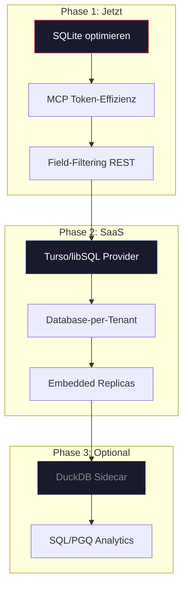

# Architektur-Review: Storage & API für Local + SaaS + KI-Tooling

## Ausgangslage

Shonkor ist ein Knowledge-Graph-System für Codebasen, das aktuell lokal läuft und zukünftig **auch als SaaS** betrieben werden soll. Die Kernfrage: Sind **SQLite + REST** die richtige Kombination — insbesondere für die Integration mit KI-Entwicklungstools (MCP), wo **Token-Effizienz** kritisch ist?

---

## Bestandsaufnahme: Was wir heute haben

### Storage Layer (SQLite + FTS5)

| Aspekt | Status |
|---|---|
| Tabellen | `Nodes` (9 Spalten), `Edges` (3 Spalten, Composite PK), `NodesFts` (FTS5 Virtual Table) |
| Volltextsuche | FTS5 mit BM25-Scoring, Fallback auf `LIKE` bei Sonderzeichen |
| Graph-Traversal | Recursive CTE (`WITH RECURSIVE`) für Subgraph-Expansion |
| Connection-Modell | Ein einzelner, langlebiger `SqliteConnection` pro Projekt (kein Pooling) |
| Schreiboperationen | Batched Upserts in Transaktionen mit Prepared Statements |
| Datenvolumen | Shonkor: ~452 KB, MuM: ~22 MB |

### API Layer (REST + MCP)

| Aspekt | Status |
|---|---|
| REST Endpoints | 20 Endpoints (ASP.NET Minimal APIs) |
| MCP Tools | 8 Tools via JSON-RPC über stdio |
| Multi-Tenancy | Rudimentär: `X-Project-Name` Header + API-Key für SaaS-Endpoints |
| Antwortformat | JSON, teilweise verbose (ganzer `GraphNode` inkl. Content) |

---

## Kritische Schwachstellen im Ist-Zustand

### 1. Storage

> [!WARNING]
> **FTS5-Rebuild bei jedem Start**: `INSERT INTO NodesFts(NodesFts) VALUES('rebuild')` läuft bei jeder `InitializeAsync()`. Bei 22 MB (MuM) dauert das bereits spürbar — bei SaaS-Skala (hunderte Projekte) nicht tragbar.

> [!WARNING]
> **N+1 Query in SearchAsync**: Für jedes Suchergebnis wird einzeln `GetRelatedEdgesAsync()` aufgerufen. Bei 20 Ergebnissen = 21 Queries statt 2.

> [!CAUTION]
> **Sync-over-Async Anti-Pattern**: `InitializeAsync()` wird in `ProjectManager.GetStorageProvider()` via `.GetAwaiter().GetResult()` synchron aufgerufen — blockiert den Thread-Pool.

- **Kein Connection-Pooling**: Ein langlebiger Connection pro Projekt. Bei SaaS mit vielen Tenants = viele offene Connections.
- **`GetAllNodesAsync()` lädt alles in den RAM** — keine Pagination.
- **Edge Properties existieren im Model, werden aber nie persistiert** — das `Properties`-Dict auf `GraphEdge` ist nutzlos.

### 2. API / Token-Effizienz

> [!IMPORTANT]
> **REST-Antworten sind zu verbose für KI-Tools**. Ein typischer `search_graph`-Response enthält pro Node: `Id`, `Type`, `Name`, `FilePath`, `StartLine`, `EndLine`, `Score`, plus alle `RelatedEdges`. Bei 10 Ergebnissen mit je 3 Edges sind das schnell **2000+ Tokens** — obwohl die KI oft nur `Id` und `Name` braucht.

- **MCP-Layer optimiert bereits teilweise**: `get_subgraph` gibt `ContentLength` statt `Content` zurück. Aber `search_graph` schickt trotzdem alles.
- **Kein Field-Filtering**: Weder REST noch MCP erlauben dem Aufrufer, nur bestimmte Felder anzufordern.
- **`generate_capsule` ist die einzige token-optimierte Operation** — sie aggregiert alles in ein kompaktes Markdown.

---

## Alternativen-Bewertung

### A. Storage-Schicht

#### Option 1: SQLite beibehalten (optimiert) ✅ Empfohlen für Phase 1

| Pro | Contra |
|---|---|
| Zero-Config, embedded, battle-tested | Kein nativer Graph-Traversal (Recursive CTEs sind langsam bei >3 Hops) |
| Perfekt für Local-First | Single-Writer Lock (problematisch bei SaaS mit Concurrent Writes) |
| Bestehender Code bleibt | Kein natives Cloud-Sync |
| FTS5 ist gut genug für aktuelle Datenmengen | FTS5-Rebuild-Problem muss gelöst werden |

**Aufwand für Optimierung**: Gering. FTS5-Rebuild nur bei Schema-Änderung, N+1 fixen, Connection-Handling verbessern.

---

#### Option 2: Turso / libSQL ⭐ Empfohlen für SaaS-Phase

| Pro | Contra |
|---|---|
| SQLite-kompatibel (minimale Migration) | Vendor Lock-in auf Turso-Plattform |
| Database-per-Tenant nativ | Kein FTS5-Support in der Cloud-Variante (Stand 2025) |
| Embedded Replicas (Local-First + Cloud-Sync) | Neues SDK-Dependency (libSQL .NET Client) |
| Automatisches Schema-Templating für neue Tenants | Emerging Technology — weniger Battle-Tested |

**Killer-Feature**: Ein und derselbe Code läuft lokal (embedded SQLite) UND als SaaS (Turso Cloud mit Sync). Das ist genau der Anwendungsfall.

**Migrationspfad**: `Microsoft.Data.Sqlite` → `Turso.Client` (.NET). Die SQL-Queries bleiben identisch.

---

#### Option 3: DuckDB + PGQ Extension

| Pro | Contra |
|---|---|
| Native Graph-Queries via SQL/PGQ (`MATCH`-Syntax) | PGQ Extension ist noch Research/WIP |
| Extrem schnelle analytische Queries | OLAP-optimiert, nicht OLTP (kein guter Fit für häufige Writes) |
| .NET ADO.NET Provider vorhanden | Keine FTS5-äquivalente Volltextsuche |
| Könnte SQLite als Analytical Sidecar ergänzen | Zwei Datenbanken = doppelte Komplexität |

**Bewertung**: Interessant als **Ergänzung** für Analytics-Dashboard, aber kein Ersatz für SQLite als primären Store. Die PGQ-Extension ist zu unreif für Production.

---

#### Option 4: PostgreSQL + pgvector

| Pro | Contra |
|---|---|
| Enterprise-proven, skaliert vertikal und horizontal | Nicht embedded — erfordert Server |
| Gute Graph-Extensions (Apache AGE) | Local-First Story ist komplex (braucht lokalen PG oder Sync-Layer) |
| Vector Search für Semantic Search | Overengineered für aktuelle Datenmengen |
| Hervorragendes .NET-Ökosystem (Npgsql, EF Core) | Deployment-Komplexität steigt erheblich |

**Bewertung**: Nur sinnvoll, wenn Turso/libSQL nicht ausreicht und du ohnehin eine Server-Infrastruktur aufbaust. Für den Local-First-Anwendungsfall zu schwer.

---

#### Option 5: Neo4j / FalkorDB

| Pro | Contra |
|---|---|
| Native Cypher-Queries, optimiert für Graph-Traversal | Server-basiert, nicht embedded |
| Community Edition kostenlos | Neue Query-Sprache (Cypher statt SQL) |
| FalkorDB ist Redis-basiert und schneller | Komplett andere API, kompletter Rewrite nötig |

**Bewertung**: Overkill. Shonkors Graphen haben <100k Nodes — Recursive CTEs in SQLite reichen völlig. Ein dediziertes Graph-DB wäre nur gerechtfertigt, wenn Multi-Hop-Traversals (>5 Hops) ein Bottleneck werden.

---

### B. API-Schicht / Token-Effizienz

#### Option 1: REST beibehalten (optimiert) ✅ Empfohlen

| Maßnahme | Token-Ersparnis | Aufwand |
|---|---|---|
| **Field-Filtering** (`?fields=id,name,type`) | ~60-70% pro Response | Gering |
| **Content-Stripping im MCP** (nur `ContentLength` statt `Content`) | ~40-50% | Bereits teilweise umgesetzt |
| **Compact Summaries** statt Raw-Daten in MCP-Tools | ~70-80% | Mittel |
| **Pagination** für große Result-Sets | Verhindert Token-Explosion | Gering |

**Warum REST reicht**: MCP ist ohnehin JSON-RPC — das ist der KI-Kanal. REST ist nur für die Web-UI. Da REST gut genug funktioniert und die Web-UI kein Token-Problem hat, ist ein Wechsel hier unnötig.

---

#### Option 2: GraphQL

| Pro | Contra |
|---|---|
| Präzise Field-Selection (kein Over-Fetching) | Neuer Server-Stack (HotChocolate in .NET) |
| Strongly-Typed Schema mit Introspection | Komplexer als REST für einfache CRUD-Ops |
| Gut für verschachtelte Graph-Daten | Overhead für Setup und Maintenance |

**Bewertung**: Löst das Over-Fetching-Problem elegant, aber für die aktuelle Projektgröße ist ein `?fields=`-Parameter auf REST deutlich pragmatischer. GraphQL lohnt sich erst, wenn die API öffentlich wird und externe Konsumenten beliebige Queries stellen müssen.

---

#### Option 3: gRPC / Protobuf

| Pro | Contra |
|---|---|
| Extrem kompakte Binary-Serialisierung | MCP ist JSON-RPC — gRPC ist inkompatibel |
| Native Streaming-Unterstützung | Browser-Clients brauchen gRPC-Web Proxy |
| Strict Typing | Overkill für aktuelle Datenmengen |

**Bewertung**: Irrelevant. MCP erzwingt JSON-RPC, die Web-UI braucht JSON. gRPC löst hier kein reales Problem.

---

### C. MCP-Layer: Wo die echten Token gespart werden

> [!IMPORTANT]
> **Die größte Token-Sparquelle ist nicht das Serialisierungsformat, sondern die Qualität der MCP-Antworten.** Ein gut aggregiertes Markdown-Capsule spart 10x mehr Tokens als ein Wechsel von JSON zu Protobuf.

| Strategie | Beschreibung | Ersparnis |
|---|---|---|
| **Smarte Capsules** | `generate_capsule` gibt bereits kompaktes Markdown zurück — das ist der richtige Ansatz | Basis |
| **Lazy Content Loading** | `search_graph` gibt nur Metadaten zurück, `Content` nur auf expliziten Abruf (neues Tool `get_node_content`) | ~50% |
| **Kompakte Edge-Zusammenfassung** | Statt 20 einzelne Edges: `"3 CALLS, 2 INHERITS, 1 BELONGS_TO"` | ~70% |
| **MCP Resource-Endpoints** | Nutze MCP Resources statt Tools für statische Daten (Stats, Schemas) — werden nicht bei jeder Anfrage geladen | ~20% |

---

## Empfehlung: Phasen-Roadmap

### Phase 1: SQLite optimieren + MCP Token-Effizienz (Jetzt)

**Ziel**: Bestehende Architektur stabilisieren und Token-Verbrauch senken.

1. **FTS5-Rebuild nur bei Schema-Migration**, nicht bei jedem Start
2. **N+1 Query in SearchAsync fixen** — eine einzige `WHERE SourceId IN (...) OR TargetId IN (...)` Query
3. **Sync-over-Async eliminieren** — `InitializeAsync()` korrekt async aufrufen
4. **MCP-Antworten komprimieren**: 
   - `search_graph`: Nur `Id`, `Type`, `Name` + aggregierte Edge-Summary
   - Neues Tool `get_node_detail` für vollständige Node-Daten on-demand
5. **Field-Filtering** in REST: `?fields=id,name,type`

**Aufwand**: ~2-3 Tage

---

### Phase 2: SaaS-Readiness mit Turso/libSQL (Wenn SaaS startet)

**Ziel**: Gleicher Code für Local und Cloud.

1. **`IGraphStorageProvider`-Interface behalten** — es ist bereits sauber abstrahiert
2. **Neue Implementierung**: `TursoGraphStorageProvider` neben `SqliteGraphStorageProvider`
3. **Database-per-Tenant**: Jeder Kunde bekommt eine eigene libSQL-Datenbank
4. **Embedded Replicas** für Local-First-Clients: Lokale Kopie mit Background-Sync
5. **Schema-Templating**: Neue Tenants erhalten automatisch das aktuelle Schema

**Aufwand**: ~1-2 Wochen

---

### Phase 3: Advanced Analytics (Optional, später)

**Ziel**: Tiefere Einblicke in den Knowledge-Graph.

1. **DuckDB als Analytics-Sidecar**: Periodischer Export aus SQLite/Turso in DuckDB
2. **SQL/PGQ Graph-Queries** für komplexe Pfadanalysen
3. **Dashboard-Widgets** die DuckDB direkt abfragen

**Aufwand**: ~1 Woche, erst relevant wenn Analytics ein Feature wird

---

## Open Questions

> [!IMPORTANT]
> **SaaS-Deployment-Ziel**: Planst du ein klassisches Server-Deployment (Azure/AWS) oder eher eine Edge-basierte Architektur (Cloudflare Workers, Fly.io)? Das beeinflusst die Turso-vs-PostgreSQL-Entscheidung maßgeblich.

> [!IMPORTANT]
> **Multi-User pro Projekt**: Sollen in der SaaS-Variante mehrere Benutzer gleichzeitig am selben Graphen arbeiten? Falls ja, brauchen wir einen Conflict-Resolution-Mechanismus (CRDTs oder Last-Write-Wins).

> [!IMPORTANT]
> **Offline-First Priorität**: Wie wichtig ist es, dass SaaS-Kunden auch offline arbeiten können? Falls ja, ist Turso mit Embedded Replicas zwingend. Falls nein, reicht auch PostgreSQL.

> [!IMPORTANT]  
> **Token-Budget**: Gibt es ein konkretes Token-Budget pro MCP-Anfrage, das wir als Zielwert nehmen sollen? (z.B. "Eine search_graph-Antwort darf maximal 500 Tokens kosten")

---

## Zusammenfassung

| Entscheidung | Empfehlung | Begründung |
|---|---|---|
| **Storage** | SQLite jetzt, Turso/libSQL für SaaS | Gleiche SQL-Queries, minimale Migration, Local-First + Cloud |
| **API** | REST beibehalten + Field-Filtering | GraphQL/gRPC lösen kein reales Problem für aktuelle Größe |
| **Token-Effizienz** | MCP-Antworten komprimieren | Smarte Aggregation > Serialisierungsformat |
| **Graph-DB** | Nein | Recursive CTEs in SQLite reichen bei <100k Nodes |
