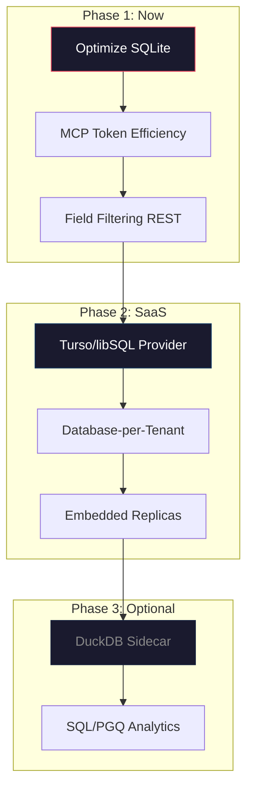

# Architecture Review: Storage & API for Local + SaaS + AI Tooling

## Initial Situation

Shonkor is a knowledge graph system for codebases that currently runs locally and is intended to **also operate as SaaS** in the future. The core question: Are **SQLite + REST** the right combination — especially for integration with AI development tools (MCP), where **token efficiency** is critical?

---

## Inventory: What We Have Today

### Storage Layer (SQLite + FTS5)

| Aspect | Status |
|---|---|
| Tables | `Nodes` (9 columns), `Edges` (3 columns, Composite PK), `NodesFts` (FTS5 Virtual Table) |
| Full-Text Search | FTS5 with BM25 scoring, fallback to `LIKE` for special characters |
| Graph Traversal | Recursive CTE (`WITH RECURSIVE`) for subgraph expansion |
| Connection Model | A single, long-lived `SqliteConnection` per project (no pooling) |
| Write Operations | Batched upserts in transactions with prepared statements |
| Data Volume | Shonkor: ~452 KB, MuM: ~22 MB |

### API Layer (REST + MCP)

| Aspect | Status |
|---|---|
| REST Endpoints | 20 endpoints (ASP.NET Minimal APIs) |
| MCP Tools | 8 tools via JSON-RPC over stdio |
| Multi-Tenancy | Rudimentary: `X-Project-Name` header + API key for SaaS endpoints |
| Response Format | JSON, partially verbose (entire `GraphNode` including content) |

---

## Critical Vulnerabilities in Current State

### 1. Storage

> [!WARNING]
> **FTS5 Rebuild at Every Startup**: `INSERT INTO NodesFts(NodesFts) VALUES('rebuild')` runs on every `InitializeAsync()`. At 22 MB (MuM) this takes noticeably long — at SaaS scale (hundreds of projects) not sustainable.

> [!WARNING]
> **N+1 Query in SearchAsync**: `GetRelatedEdgesAsync()` is called individually for each search result. With 20 results = 21 queries instead of 2.

> [!CAUTION]
> **Sync-over-Async Anti-Pattern**: `InitializeAsync()` is called synchronously in `ProjectManager.GetStorageProvider()` via `.GetAwaiter().GetResult()` — blocks the thread pool.

- **No Connection Pooling**: A long-lived connection per project. In SaaS with many tenants = many open connections.
- **`GetAllNodesAsync()` loads everything into RAM** — no pagination.
- **Edge properties exist in the model but are never persisted** — the `Properties` dict on `GraphEdge` is useless.

### 2. API / Token Efficiency

> [!IMPORTANT]
> **REST responses are too verbose for AI tools**. A typical `search_graph` response contains per node: `Id`, `Type`, `Name`, `FilePath`, `StartLine`, `EndLine`, `Score`, plus all `RelatedEdges`. With 10 results each having 3 edges, that quickly becomes **2000+ tokens** — even though the AI often only needs `Id` and `Name`.

- **MCP layer already partially optimizes**: `get_subgraph` returns `ContentLength` instead of `Content`. But `search_graph` still sends everything.
- **No Field Filtering**: Neither REST nor MCP allow the caller to request only specific fields.
- **`generate_capsule` is the only token-optimized operation** — it aggregates everything into a compact Markdown.

---

## Alternatives Evaluation

### A. Storage Layer

#### Option 1: Keep SQLite (optimized) ✅ Recommended for Phase 1

| Pro | Con |
|---|---|
| Zero-config, embedded, battle-tested | No native graph traversal (recursive CTEs are slow at >3 hops) |
| Perfect for Local-First | Single-writer lock (problematic for SaaS with concurrent writes) |
| Existing code remains | No native cloud sync |
| FTS5 is good enough for current data volumes | FTS5 rebuild problem must be solved |

**Effort for Optimization**: Low. FTS5 rebuild only on schema change, fix N+1, improve connection handling.

---

#### Option 2: Turso / libSQL ⭐ Recommended for SaaS Phase

| Pro | Con |
|---|---|
| SQLite compatible (minimal migration) | Vendor lock-in on Turso platform |
| Database-per-tenant native | No FTS5 support in the cloud variant (as of 2025) |
| Embedded Replicas (Local-First + Cloud-Sync) | New SDK dependency (libSQL .NET Client) |
| Automatic schema templating for new tenants | Emerging technology — less battle-tested |

**Killer Feature**: The exact same code runs locally (embedded SQLite) AND as SaaS (Turso Cloud with sync). That is exactly the use case.

**Migration Path**: `Microsoft.Data.Sqlite` → `Turso.Client` (.NET). The SQL queries remain identical.

---

#### Option 3: DuckDB + PGQ Extension

| Pro | Con |
|---|---|
| Native Graph Queries via SQL/PGQ (`MATCH` syntax) | PGQ extension is still research/WIP |
| Extremely fast analytical queries | OLAP-optimized, not OLTP (not a good fit for frequent writes) |
| .NET ADO.NET Provider available | No FTS5-equivalent full-text search |
| Could complement SQLite as analytical sidecar | Two databases = double the complexity |

**Evaluation**: Interesting as a **complement** for analytics dashboards, but not a replacement for SQLite as the primary store. The PGQ extension is too immature for production.

---

#### Option 4: PostgreSQL + pgvector

| Pro | Con |
|---|---|
| Enterprise-proven, scales vertically and horizontally | Not embedded — requires server |
| Good graph extensions (Apache AGE) | Local-First story is complex (needs local PG or sync layer) |
| Vector search for semantic search | Overengineered for current data volumes |
| Excellent .NET ecosystem (Npgsql, EF Core) | Deployment complexity increases significantly |

**Evaluation**: Only makes sense if Turso/libSQL is insufficient and you are building server infrastructure anyway. Too heavy for the Local-First use case.

---

#### Option 5: Neo4j / FalkorDB

| Pro | Con |
|---|---|
| Native Cypher queries, optimized for graph traversal | Server-based, not embedded |
| Community Edition free | New query language (Cypher instead of SQL) |
| FalkorDB is Redis-based and faster | Completely different API, complete rewrite necessary |

**Evaluation**: Overkill. Shonkor's graphs have <100k nodes — recursive CTEs in SQLite are perfectly adequate. A dedicated graph DB would only be justified if multi-hop traversals (>5 hops) become a bottleneck.

---

### B. API Layer / Token Efficiency

#### Option 1: Keep REST (optimized) ✅ Recommended

| Measure | Token Savings | Effort |
|---|---|---|
| **Field Filtering** (`?fields=id,name,type`) | ~60-70% per response | Low |
| **Content Stripping in MCP** (only `ContentLength` instead of `Content`) | ~40-50% | Partially implemented already |
| **Compact Summaries** instead of raw data in MCP tools | ~70-80% | Medium |
| **Pagination** for large result sets | Prevents token explosion | Low |

**Why REST is enough**: MCP is JSON-RPC anyway — that is the AI channel. REST is only for the Web UI. Since REST works well enough and the Web UI doesn't have a token problem, a change here is unnecessary.

---

#### Option 2: GraphQL

| Pro | Con |
|---|---|
| Precise field selection (no over-fetching) | New server stack (HotChocolate in .NET) |
| Strongly-typed schema with introspection | More complex than REST for simple CRUD ops |
| Good for nested graph data | Overhead for setup and maintenance |

**Evaluation**: Elegantly solves the over-fetching problem, but for the current project size, a `?fields=` parameter on REST is much more pragmatic. GraphQL only pays off when the API becomes public and external consumers need to make arbitrary queries.

---

#### Option 3: gRPC / Protobuf

| Pro | Con |
|---|---|
| Extremely compact binary serialization | MCP is JSON-RPC — gRPC is incompatible |
| Native streaming support | Browser clients need gRPC-Web proxy |
| Strict typing | Overkill for current data volumes |

**Evaluation**: Irrelevant. MCP forces JSON-RPC, the Web UI needs JSON. gRPC solves no real problem here.

---

### C. MCP Layer: Where the Real Tokens are Saved

> [!IMPORTANT]
> **The biggest source of token savings is not the serialization format, but the quality of the MCP responses.** A well-aggregated Markdown capsule saves 10x more tokens than switching from JSON to Protobuf.

| Strategy | Description | Savings |
|---|---|---|
| **Smart Capsules** | `generate_capsule` already returns compact Markdown — that is the right approach | Baseline |
| **Lazy Content Loading** | `search_graph` only returns metadata, `Content` only upon explicit request (new tool `get_node_content`) | ~50% |
| **Compact Edge Summary** | Instead of 20 individual edges: `"3 CALLS, 2 INHERITS, 1 BELONGS_TO"` | ~70% |
| **MCP Resource Endpoints** | Use MCP Resources instead of tools for static data (stats, schemas) — they are not loaded on every request | ~20% |

---

## Recommendation: Phased Roadmap

### Phase 1: Optimize SQLite + MCP Token Efficiency (Now)

**Goal**: Stabilize existing architecture and reduce token consumption.

1. **FTS5 Rebuild only on schema migration**, not at every startup
2. **Fix N+1 query in SearchAsync** — a single `WHERE SourceId IN (...) OR TargetId IN (...)` query
3. **Eliminate Sync-over-Async** — call `InitializeAsync()` correctly async
4. **Compress MCP responses**: 
   - `search_graph`: Only `Id`, `Type`, `Name` + aggregated edge summary
   - New tool `get_node_detail` for full node data on-demand
5. **Field Filtering** in REST: `?fields=id,name,type`

**Effort**: ~2-3 days

---

### Phase 2: SaaS Readiness with Turso/libSQL (When SaaS starts)

**Goal**: Same code for Local and Cloud.

1. **Keep `IGraphStorageProvider` interface** — it is already cleanly abstracted
2. **New Implementation**: `TursoGraphStorageProvider` alongside `SqliteGraphStorageProvider`
3. **Database-per-Tenant**: Every customer gets their own libSQL database
4. **Embedded Replicas** for Local-First clients: Local copy with background sync
5. **Schema Templating**: New tenants automatically receive the current schema

**Effort**: ~1-2 weeks

---

### Phase 3: Advanced Analytics (Optional, later)

**Goal**: Deeper insights into the knowledge graph.

1. **DuckDB as Analytics Sidecar**: Periodic export from SQLite/Turso into DuckDB
2. **SQL/PGQ Graph Queries** for complex path analyses
3. **Dashboard Widgets** that query DuckDB directly

**Effort**: ~1 week, only relevant once analytics becomes a feature

---

## Open Questions

> [!IMPORTANT]
> **SaaS Deployment Target**: Are you planning a classic server deployment (Azure/AWS) or more of an edge-based architecture (Cloudflare Workers, Fly.io)? This heavily influences the Turso vs PostgreSQL decision.

> [!IMPORTANT]
> **Multi-User per Project**: Should multiple users be able to work simultaneously on the same graph in the SaaS variant? If so, we need a conflict resolution mechanism (CRDTs or Last-Write-Wins).

> [!IMPORTANT]
> **Offline-First Priority**: How important is it that SaaS customers can also work offline? If yes, Turso with Embedded Replicas is mandatory. If no, PostgreSQL is sufficient.

> [!IMPORTANT]  
> **Token Budget**: Is there a specific token budget per MCP request that we should take as a target value? (e.g., "A search_graph response must cost a maximum of 500 tokens")

---

## Summary

| Decision | Recommendation | Rationale |
|---|---|---|
| **Storage** | SQLite now, Turso/libSQL for SaaS | Same SQL queries, minimal migration, Local-First + Cloud |
| **API** | Keep REST + Field Filtering | GraphQL/gRPC solve no real problem for current size |
| **Token Efficiency** | Compress MCP responses | Smart aggregation > serialization format |
| **Graph-DB** | No | Recursive CTEs in SQLite are sufficient for <100k nodes |
