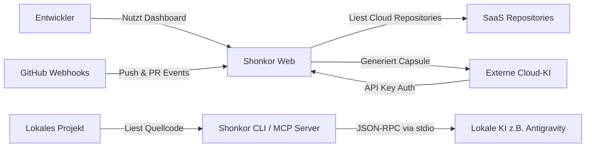

# arc42 Kapitel 3: Kontextabgrenzung 🌐

Dieses Kapitel beschreibt die Schnittstellen von Shonkor zu seiner Umwelt.

---

## 3.1 Fachlicher Kontext

Aus fachlicher Sicht fungiert Shonkor als Vermittler zwischen dem physischen Quellcode eines Entwicklers und einem Large Language Model (LLM).

* **Entwickler**: Nutzt das lokale Dashboard oder KI-Agenten zur Architektur-Exploration.
* **Workspace (Projekt-Quellcode)**: Physische Quelldateien (Lokal oder im SaaS-Tenant).
* **Lokale KI (z.B. Antigravity/Claude Code)**: Greift über das Model Context Protocol (MCP) direkt auf die `Shonkor.CLI` zu. Das Projekt wird aus dem Arbeitsverzeichnis des Clients abgeleitet (kein globales aktives Flag).
* **GitHub (SaaS)**: Sendet Push- und Installations-Webhooks (HMAC-signiert via `X-Hub-Signature-256`), woraufhin Shonkor Projekte (Tenants) anlegt und inkrementell indiziert.
* **Externe Cloud-KI (z.B. ChatGPT)**: Ruft die `/api/rag/query` SaaS-Endpunkte mit `X-API-Key` Authentifizierung auf.

---

## 3.2 Technischer Kontext

Shonkor kann sowohl als **lokales Entwickler-Werkzeug** als auch als **Multi-Tenant SaaS-Plattform** betrieben werden.

* **Dateisystem-Crawler (Infrastructure)**: Liest Quellcodedateien ein und generiert inkrementell den Graphen.
* **SQLite-Speicher**: Speichert Knoten/Kanten pro Tenant isoliert (`shonkor.db`) und indiziert Code-Ausschnitte via FTS5.
* **Web-API (ASP.NET Core)**: 
  * Liefert das Dashboard aus.
  * `ApiKeyMiddleware`: Schirmt SaaS-Endpunkte ab (konstantzeitiger Key-Vergleich, Loopback-Bypass nur in Development) und leitet Anfragen automatisch auf die Tenant-DB um.
  * `WebhookEndpoints`: Nimmt GitHub-Events (`install`, `push`, `pr`) entgegen und verifiziert deren HMAC-Signatur (fail-closed ohne Secret).
  * `GraphRagEndpoints`: Bietet KIs die direkte Schnittstelle zur Kapsel-Generierung.
* **MCP Server (CLI)**: Stellt KI-Editoren wie Claude Code oder Antigravity über `stdio` einen direkten Zugriff auf den lokalen Graphen bereit. Das aktive Projekt wird aus dem Arbeitsverzeichnis abgeleitet; token-effiziente Tools (`locate`, `search_graph`, `get_subgraph`).
