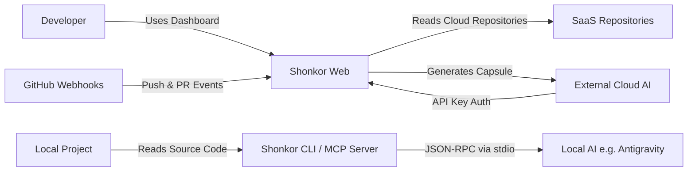

# arc42 Chapter 3: System Scope and Context 🌐

This chapter describes the interfaces of Shonkor with its environment.

---

## 3.1 Business Context

From a business perspective, Shonkor acts as an intermediary between a developer's physical source code and a Large Language Model (LLM).

* **Developer**: Uses the local dashboard or AI agents for architecture exploration.
* **Workspace (Project Source Code)**: Physical source files (local or in the SaaS tenant).
* **Local AI (e.g., Antigravity/Claude Code)**: Accesses the `Shonkor.CLI` directly via the Model Context Protocol (MCP). The project is derived from the client's working directory (no global active flag).
* **GitHub (SaaS)**: Sends push and installation webhooks (HMAC-signed via `X-Hub-Signature-256`), triggering Shonkor to create projects (tenants) and incrementally index them.
* **External Cloud AI (e.g., ChatGPT)**: Calls the `/api/rag/query` SaaS endpoints with `X-API-Key` authentication.

---

## 3.2 Technical Context

Shonkor can be operated both as a **local developer tool** and as a **multi-tenant SaaS platform**.

* **File System Crawler (Infrastructure)**: Reads source code files and incrementally generates the graph.
* **SQLite Storage**: Stores nodes/edges isolated per tenant (`shonkor.db`) and indexes code snippets via FTS5.
* **Web API (ASP.NET Core)**: 
  * Serves the dashboard.
  * `ApiKeyMiddleware`: Shields SaaS endpoints (tokens stored SHA-256 hashed, constant-time comparison, loopback bypass only in development, `/health*` exempt) and automatically routes requests to the tenant DB.
  * `WebhookEndpoints`: Receives GitHub events (`install`, `push`, `pr`) and verifies their HMAC signature (fail-closed without a secret).
  * `GraphRagEndpoints`: Provides AIs with a direct interface for capsule generation.
* **MCP Server (CLI)**: Provides AI editors like Claude Code or Antigravity with direct access to the local graph via `stdio`. The active project is derived from the working directory. The token-efficient toolset spans find (`locate`, `search_graph`), read (`get_source`, `get_subgraph`, `generate_capsule`), analyze (`references`, `find_usages`, `find_path`, `verify_exists`), and the edit loop (`reindex_file`). See the [LLM Integration Manual](../../user/llm_integration.md) for the full reference.
