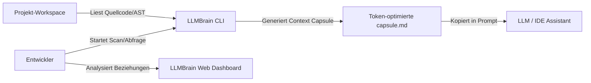

# arc42 Kapitel 3: Kontextabgrenzung 🌐

Dieses Kapitel beschreibt die Schnittstellen von LLMBrain zu seiner Umwelt.

---

## 3.1 Fachlicher Kontext

Aus fachlicher Sicht fungiert LLMBrain als Vermittler zwischen dem physischen Quellcode eines Entwicklers und einem Large Language Model (LLM).

* **Entwickler**: Stellt Suchanfragen und konfiguriert Ausschlusskriterien.
* **Workspace (Projekt-Quellcode)**: Die physischen Quelldateien (C#, JS, PHP, YAML, MD), die als Eingabedaten dienen.
* **LLM (z. B. Cursor, ChatGPT)**: Das nachgelagerte Konsumentensystem, welches die strukturierte Markdown-Kapsel als Eingabe (Context) erhält.

---

## 3.2 Technischer Kontext

LLMBrain läuft vollständig innerhalb einer isolierten Benutzerumgebung auf dem lokalen Betriebssystem des Anwenders.

* **Dateisystem-Crawler (Infrastructure)**: Liest Quellcodedateien ein, berechnet SHA256-Prüfsummen und interagiert mit den domänenspezifischen Parsern (Roslyn, Esprima, etc.).
* **SQLite-Speicher**: Speichert Knoten und Kanten in relationalen Tabellen und indiziert Code-Ausschnitte in FTS5-Tabellen zur Keyword-Suche.
* **Web-API (ASP.NET Core Web)**: Ein lokaler Webserver (Minimal APIs), der statische Assets (HTML/CSS/JS) an den Webbrowser ausliefert und Daten via JSON-Schnittstellen bereitstellt.
* **Benutzer-Browser**: Rendert das Glassmorphic-Dashboard und verarbeitet Canvas-basierte Netzwerk-Visualisierungen.
