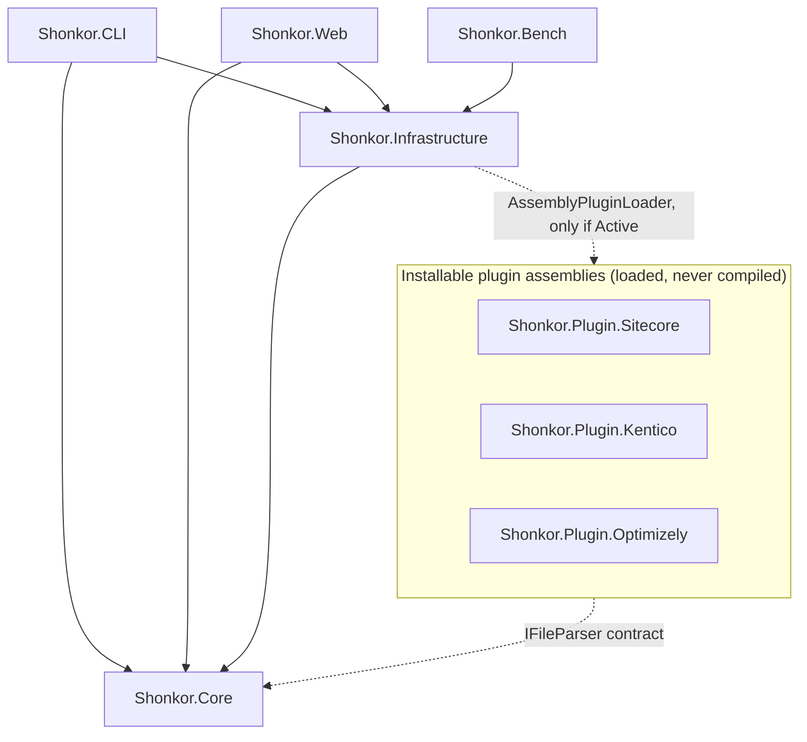
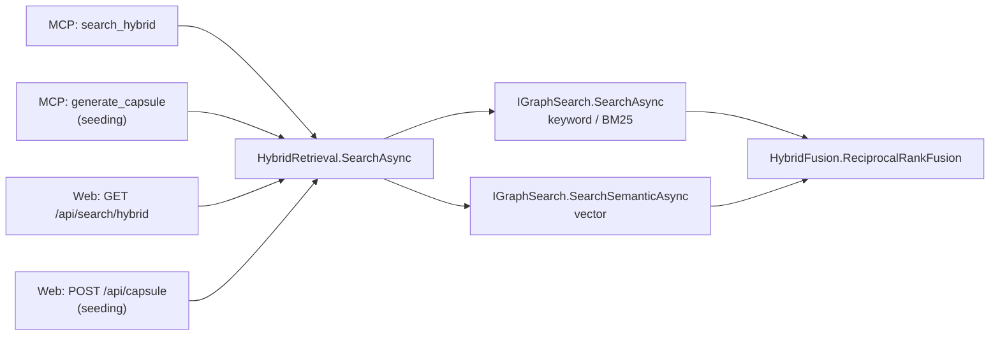

# arc42 Chapter 5: Building Block View 🧱

This chapter describes the static decomposition of the Shonkor system into logical components.

---

## 5.1 Overall System (Level 1)

The system separates layers strictly (Clean Architecture). Four projects carry the runtime; the CMS parsers ship as **separate, pre-built plugin assemblies**, and the benchmark harness is its own project.

### 1. Shonkor.Core (Domain Layer)
* **Responsibility**: Defines the knowledge graph's data structures and the abstractions for parsing, retrieval and persistence. It holds no *infrastructure* dependencies (no SQLite, no HTTP) — but it is **not dependency-free**: it carries the AST compiler libraries (Roslyn, Esprima, YamlDotNet), because parsing *is* domain work here.
* **Important Building Blocks**:
  * `GraphNode`, `GraphEdge`, `SearchResult`, `GraphStatistics`, `NodeTypeDescriptor` (Models)
  * `IFileParser`, `IGraphStorageProvider`, `IGraphSearch`, `IEmbeddingService` (Interfaces)
  * Parsers: `RoslynAstParser` (C#, incl. type references), `JavaScriptParser`, `PhpModuleParser`, `GraphQLParser`, `MarkdownHierarchyParser`
  * `ContextCapsuleSynthesizer`: assembles prompt-ready Markdown contexts. Budget-aware (`CapsuleOptions`): seeds render first and in full, the remainder fills a bounded token budget by structural relevance, and a hub cap keeps a 2-hop expansion from exploding the prompt.
  * **`HybridRetrieval`** — see 5.2. The single retrieval entry point.
  * `HybridFusion`: Reciprocal Rank Fusion of two ranked result lists.
  * `CsharpNodeId`: the node-id scheme (currently **v6**) and its version stamp, which drives the force-reparse migration on upgrade.

### 2. Shonkor.Infrastructure (Infrastructure Layer)
* **Responsibility**: Implements the Core interfaces against concrete storage, file system and model technologies.
* **Important Building Blocks**:
  * `SqliteGraphStorageProvider`: Encapsulates the SQLite driver, builds tables/FTS5 indexes, and executes recursive CTE graph queries. **Opens a dedicated (pooled) connection per operation** — thread-safe for parallel web requests; in-memory DBs are kept alive via a keep-alive connection with shared cache. Vector search scores **L2-normalized embeddings with a dot product**, reading the BLOB zero-copy (`MemoryMarshal.Cast`), with a similarity floor.
  * `VectorMath` (`Storage/`): L2 normalization and unit-length checks, built on `System.Numerics.Tensors.TensorPrimitives`. **It lives in Infrastructure, not Core** — vectors are a storage concern here, and the SIMD primitive is the canonical implementation rather than a hand-rolled loop.
  * `GraphIndexScanner`: Scans directories, detects changed files via SHA256 (hash lookup instead of full content load), skips binary files, and coordinates the parsers.
  * `CrossTechLinker`: Post-scan pass resolving cross-technology edges (Next.js ↔ Sitecore ↔ C# ↔ GraphQL) and Helix modules. C# references are resolved **semantically by default** (Roslyn `SemanticModel` → exact `REFERENCES_TYPE`/`IMPLEMENTS`/`EXTENDS`/`CALLS`), falling back to name matching where a partial checkout can't resolve — so the pass is never *worse* than syntactic, only more precise. Exactly-resolved edges are tagged `EXTRACTED`; heuristic ones `INFERRED`.
  * `ProjectManager`: Manages the multi-project registry (`projects.json`), caches `IGraphStorageProvider` per project (via `Lazy<>`), coordinates parallel scans, and resolves projects from a directory (`FindProjectByPath`).
  * `OllamaSemanticAnalyzer` / embedding services: Contact a local Ollama REST API (e.g. `qwen2.5-coder` for summaries, `nomic-embed-text` for vectors). `OllamaRetry` classifies transient vs. connect errors and backs off with jitter, so a flaky backend degrades instead of failing the caller.
  * **Plugin host** — `PluginRegistry` validates a plugin's `plugin.json` manifest and host-API version, extracts the ZIP (zip-slip guarded) and tracks the `Installed → Active → Disabled/Failed` lifecycle. `AssemblyPluginLoader` loads **only Active** plugins into a collectible `AssemblyLoadContext`.
    > ⚠️ **There is no runtime compilation of plugin source.** A plugin is a *pre-built assembly*, installed from a ZIP, and **inert until explicitly activated**. The former Roslyn source-compilation path (`PluginLoader`, `StandardPlugins/` embedded sources) — an arbitrary-code-execution surface — **has been removed**. Installing a plugin runs nothing; activation is the trust gate.
  * `Services/Mcp/`: the MCP tool registry — see 5.3.

### 3. Shonkor.CLI (Application Layer)
* **Responsibility**: Console interface and the stdio MCP server.
* **Important Building Blocks**:
  * `Program.cs`: Handles `init`, `index` (`--embed` populates vectors), `search`, `capsule`, `agents`, `plugin`, and `mcp` (+ `mcp install` / `mcp status`), and prints formatted reports.
  * `McpRequestHandler`: JSON-RPC-over-stdio envelope (`initialize` / `ping` / `tools/list` / `tools/call`) and protocol-version negotiation. It holds *only* the loop and the envelope — the tools themselves live in the registry (5.3). Tool failures are returned as `isError:true` results carrying the tool name and the exception **type**, never the raw exception message.
  * `McpInstaller`: Writes client configuration (Claude Desktop, Claude Code, Antigravity).

### 4. Shonkor.Web (Presentation Layer)
* **Responsibility**: Interactive dashboard, REST API, SaaS/webhook endpoints, and the background enrichment worker.
* **Important Building Blocks**:
  * `Program.cs`: ASP.NET Core WebHost with Minimal APIs (stats, search, subgraph, capsule, indexing, node references/path, insights, settings, project and plugin management, file-system browser). Maps liveness `/health`·`/health/live` and readiness `/health/ready`; emits JSON logs in Production.
  * `Middleware/ApiKeyMiddleware`: Multi-tenant token validation against **SHA-256 hashes** (`TokenHasher`, constant-time `FixedTimeEquals`; legacy plaintext self-migrated). The loopback bypass is restricted to Development **and** opt-out-able, and warns loudly at startup when active.
  * `Endpoints/SearchEndpoints`: `/api/search` (FTS), `/api/search/hybrid` and `/api/capsule` — the latter two **delegate to `HybridRetrieval`** (5.2).
  * `HealthChecks/StorageHealthCheck`: Readiness — workspace writable and active graph store answering.
  * `Endpoints/GraphRagEndpoints`, `Endpoints/WebhookEndpoints`: Grounded RAG answers (per-claim citations, streamed) and HMAC-verified GitHub webhooks (fail-closed without a secret).
  * `Services/SemanticEnrichmentService`: Background worker that enriches nodes via Ollama (summaries + embeddings) with bounded parallelism and an exponential-backoff circuit breaker. After a completed cycle it **prunes orphaned `Concept` nodes** (concepts with no incoming `RELATES_TO`), which otherwise accumulate and degrade semantic precision.
  * `wwwroot/`: Glassmorphic frontend with `force-graph` (WebGL canvas), an Impact & Dependencies drawer + Find-Path tool, an Insights panel, and Prism.js.

### 5. Shonkor.Bench (Measurement)
* **Responsibility**: The single benchmark harness — token reduction, retrieval precision (P@1 / P@k / Recall@k / MRR for FTS, vector and hybrid), the matched-budget RAG head-to-head, and answer groundedness. Golden sets live under `bench/golden/`; `--baseline` gates a run against stored metrics, and `--check-circularity` guards a golden set from becoming self-matching.
* It **supersedes** the former `Shonkor.Eval` and `Shonkor.Benchmarks` projects, which no longer exist.

---

## 5.2 `HybridRetrieval` — the single retrieval entry point (Level 2)

`Shonkor.Core.Services.HybridRetrieval.SearchAsync(IGraphSearch, IEmbeddingService?, query, count)` is **the one implementation of hybrid retrieval in the system**. It runs the keyword (FTS/BM25) and vector arms, fuses them by Reciprocal Rank Fusion, and degrades to **FTS-only** when no embedding backend is wired or the embedding call fails — so a missing or slow backend never hard-fails a query.

It lives in **Core** because every one of its dependencies (`IGraphSearch`, `IEmbeddingService`, `SearchResult`, `HybridFusion`) already does.

**All four call sites delegate to it — this is an invariant, not a coincidence:**

> **Why this is written down.** These four sites previously held **three near-duplicate copies** of the fusion logic, and they had already drifted: `/api/capsule` still seeded **FTS-only**, so the dashboard retrieved measurably worse than the MCP tool for intent-phrased queries. Consolidating them fixed that bug by construction. **A fifth copy of this logic is a defect** — extend `HybridRetrieval` instead.

---

## 5.3 MCP tool registry (Level 2)

The MCP surface is a registry, not a god-class. `McpRequestHandler` keeps only the stdio loop and the JSON-RPC envelope; each tool is an `IMcpTool` implementation resolved through `McpToolRegistry` (built by `McpToolRegistryFactory`).

* `IMcpTool` — the contract (name, schema, `ExecuteAsync`).
* `McpToolContext` — shared state handed to every tool (project manager, storage, capsule synthesizer, embedding service, hybrid search).
* `McpToolHelpers` — shared guards, including **path containment** (`TryResolveContainedPath`: a caller-supplied path is resolved against the project base and rejected if it escapes the workspace) and the output caps (result limits, hop limits, a 32 KiB output cap).
* `Tools/` — the tools themselves: **one `IMcpTool` class per tool** (`SearchGraphTool`, `SearchHybridTool`, `GetSourceTool`, `ReferencesTool`, `GenerateCapsuleTool`, `CheckEditTool`, `BlastRadiusTool`, …), grouped into files by purpose (`FindTools.cs`, `ReadTools.cs`, `AnalyzeTools.cs`, `EditLoopTools.cs`, `MemoryAndStatsTools.cs`, `MetaTools.cs`). The file names are containers, not types.

Capability gating: `search_semantic` is only *listed* when an embedding backend is actually wired, so the local stdio CLI never advertises an inert tool.
