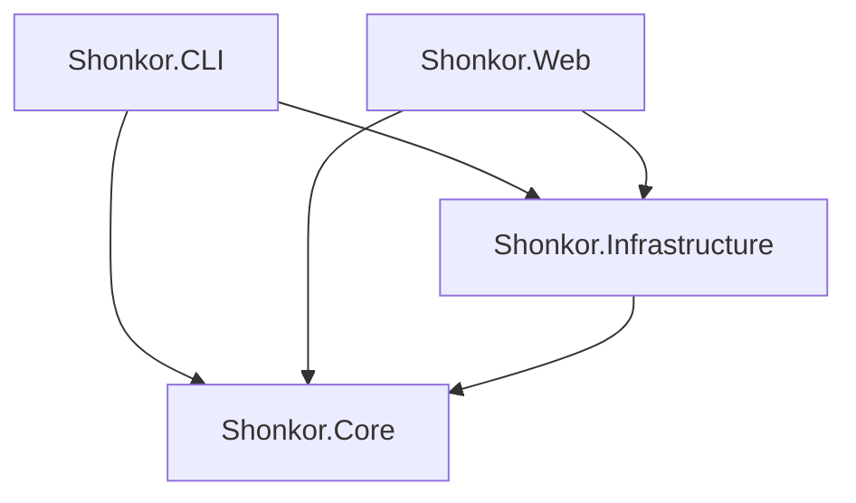

# arc42 Chapter 5: Building Block View 🧱

This chapter describes the static decomposition of the Shonkor system into logical components.

---

## 5.1 Overall System (Level 1)

The system is divided into four main projects that implement a strict separation of layers (Clean Architecture):

### 1. Shonkor.Core (Domain Layer)
* **Responsibility**: Defines the foundational data structures of the knowledge graph and the abstractions for parsing and persistence. Contains no external framework dependencies (except AST compiler libraries).
* **Important Building Blocks**:
  * `GraphNode`, `GraphEdge`, `SearchResult`, `GraphStatistics`, `NodeTypeDescriptor` (Models)
  * `IFileParser`, `IGraphStorageProvider` (Interfaces)
  * Parsers: `RoslynAstParser` (C#, incl. type references), `JavaScriptParser`, `PhpModuleParser`, `GraphQLParser`, `MarkdownHierarchyParser`
  * `StandardPlugins/`: Example plugins delivered as EmbeddedResource (Kentico, Optimizely, Sitecore Unicorn/XM Cloud)
  * `ContextCapsuleSynthesizer` (Service for assembling Markdown contexts)

### 2. Shonkor.Infrastructure (Infrastructure Layer)
* **Responsibility**: Implements the interfaces of the Core project using concrete storage and file system technologies.
* **Important Building Blocks**:
  * `SqliteGraphStorageProvider`: Encapsulates the SQLite driver, builds tables/FTS5 indexes, and executes recursive CTE graph queries. **Opens a dedicated (pooled) connection per operation** – thread-safe for parallel web requests; In-Memory DBs are kept alive via a Keep-Alive-Connection with Shared-Cache.
  * `GraphIndexScanner`: Scans directories, detects changed files via SHA256 (hash lookup instead of full content load), skips binary files, and coordinates the parsers.
  * `CrossTechLinker`: Post-scan pass that resolves and persists cross-technology edges (Next.js ↔ Sitecore ↔ C# ↔ GraphQL), Helix modules, as well as **C# type references (`REFERENCES_TYPE`)**.
  * `ProjectManager`: Manages the multi-project registry (`projects.json`), caches `IGraphStorageProvider` per project (via `Lazy<>`), coordinates parallel scans, and resolves projects from a directory (`FindProjectByPath`).
  * `OllamaSemanticAnalyzer`: Contacts a local Ollama REST API (e.g., `qwen2.5-coder`) to asynchronously transform source code nodes into highly condensed architectural summaries (JSON).
  * `PluginLoader`: Compiles C# plugins at runtime (Roslyn) into a **collectible, unloadable** `AssemblyLoadContext` (Opt-in, RCE relevant).

### 3. Shonkor.CLI (Application Layer)
* **Responsibility**: Provides the console interface and the MCP server.
* **Important Building Blocks**:
  * `Program.cs`: Processes arguments for `init`, `index`, `search`, `capsule`, and `mcp` (+`mcp install`) and outputs formatted reports.
  * `McpServer`: JSON-RPC-over-stdio server that exposes the graph to AI assistants. Token-efficient outputs across find/read/analyze/edit-loop tools (`locate`, `search_graph`, `search_semantic`, `get_source`, `get_subgraph`, `impact_of`, `depends_on`, `find_usages`, `find_path`, `verify_exists`, `reindex_file`); derives the context project from the working directory.
  * `McpInstaller`: Writes the client configuration (Claude Desktop, Antigravity).

### 4. Shonkor.Web (Presentation Layer)
* **Responsibility**: Provides a graphical, interactive dashboard and SaaS/Webhook endpoints.
* **Important Building Blocks**:
  * `Program.cs`: ASP.NET Core WebHost with Minimal APIs (Stats, Search, Subgraph, Capsule, Indexing, Project and Plugin Management, File System Browser).
  * `Middleware/ApiKeyMiddleware`: Multi-tenant API key validation (constant time) with a loopback bypass restricted to Development.
  * `Endpoints/GraphRagEndpoints`, `Endpoints/WebhookEndpoints`: SaaS RAG queries and HMAC-verified GitHub Webhooks.
  * `Services/SemanticEnrichmentService`: Background worker (`BackgroundService`) that asynchronously retrieves nodes from the SQLite database, passes them to the `OllamaSemanticAnalyzer` for analysis, and writes the generated AI summaries back into the database.
  * `wwwroot/`: Glassmorphic HTML/CSS/JS frontend with `force-graph` (WebGL canvas network visualization) and Prism.js (Syntax Highlighting).
