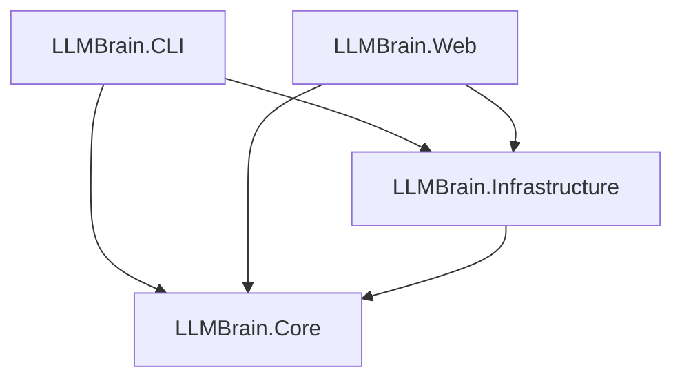

# arc42 Kapitel 5: Bausteinsicht 🧱

Dieses Kapitel beschreibt die statische Zerlegung des LLMBrain-Systems in logische Komponenten.

---

## 5.1 Gesamtsystem (Ebene 1)

Das System ist in vier Hauptprojekte aufgeteilt, die eine strikte Schichtentrennung (Clean Architecture) implementieren:

### 1. LLMBrain.Core (Domain Layer)
* **Verantwortung**: Definiert die grundlegenden Datenstrukturen des Wissensgraphen und die Abstraktionen für Parsing und Persistenz. Enthält keinerlei externe Framework-Abhängigkeiten (außer AST-Compiler-Bibliotheken).
* **Wichtige Bausteine**:
  * `GraphNode`, `GraphEdge`, `SearchResult`, `GraphStatistics` (Modelle)
  * `IFileParser`, `IGraphStorageProvider` (Schnittstellen)
  * `ContextCapsuleSynthesizer` (Dienst zur Zusammenstellung von Markdown-Kontexten)

### 2. LLMBrain.Infrastructure (Infrastructure Layer)
* **Verantwortung**: Implementiert die Schnittstellen des Core-Projekts unter Verwendung konkreter Speicher- und Dateisystem-Technologien.
* **Wichtige Bausteine**:
  * `SqliteGraphStorageProvider`: Kapselt den SQLite-Treiber, baut die Tabellen/FTS5-Indizes auf und führt rekursive CTE-Graphabfragen aus.
  * `GraphIndexScanner`: Verwaltet das Scannen von Verzeichnissen, vergleicht SHA256-Hashes zur Performanzoptimierung und koordiniert die Parser.

### 3. LLMBrain.CLI (Application Layer)
* **Verantwortung**: Stellt die Konsolen-Schnittstelle für Scripting, Automatisierung und schnellen Terminal-Zugriff bereit.
* **Wichtige Bausteine**:
  * `Program.cs`: Verarbeitet Argumente für `init`, `index`, `search` und `capsule` und gibt formatierte Berichte aus.

### 4. LLMBrain.Web (Presentation Layer)
* **Verantwortung**: Stellt ein grafisches, interaktives Dashboard bereit, um den Wissensgraphen visuell zu durchsuchen und zu analysieren.
* **Wichtige Bausteine**:
  * `Program.cs`: ASP.NET Core WebHost mit Minimal APIs für JSON-Datenabfragen.
  * `wwwroot/`: Glassmorphes HTML/CSS/JS Frontend unter Verwendung von Vis.js (Netzwerk-Visualisierung) und Prism.js (Syntax-Highlighting).
