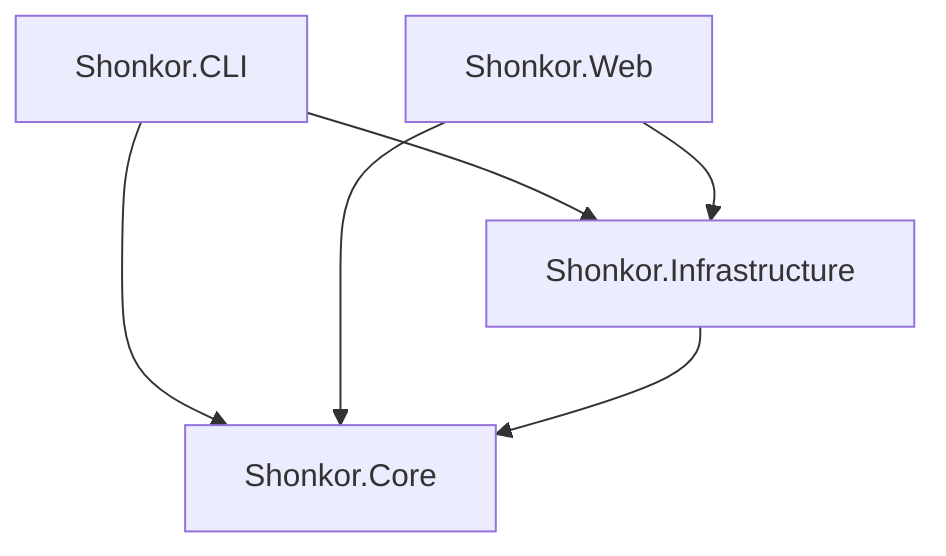

# arc42 Kapitel 5: Bausteinsicht 🧱

Dieses Kapitel beschreibt die statische Zerlegung des Shonkor-Systems in logische Komponenten.

---

## 5.1 Gesamtsystem (Ebene 1)

Das System ist in vier Hauptprojekte aufgeteilt, die eine strikte Schichtentrennung (Clean Architecture) implementieren:

### 1. Shonkor.Core (Domain Layer)
* **Verantwortung**: Definiert die grundlegenden Datenstrukturen des Wissensgraphen und die Abstraktionen für Parsing und Persistenz. Enthält keinerlei externe Framework-Abhängigkeiten (außer AST-Compiler-Bibliotheken).
* **Wichtige Bausteine**:
  * `GraphNode`, `GraphEdge`, `SearchResult`, `GraphStatistics`, `NodeTypeDescriptor` (Modelle)
  * `IFileParser`, `IGraphStorageProvider` (Schnittstellen)
  * Parser: `RoslynAstParser` (C#, inkl. Typ-Referenzen), `JavaScriptParser`, `PhpModuleParser`, `GraphQLParser`, `MarkdownHierarchyParser`
  * `StandardPlugins/`: Als EmbeddedResource ausgelieferte Beispiel-Plugins (Kentico, Optimizely, Sitecore Unicorn/XM Cloud)
  * `ContextCapsuleSynthesizer` (Dienst zur Zusammenstellung von Markdown-Kontexten)

### 2. Shonkor.Infrastructure (Infrastructure Layer)
* **Verantwortung**: Implementiert die Schnittstellen des Core-Projekts unter Verwendung konkreter Speicher- und Dateisystem-Technologien.
* **Wichtige Bausteine**:
  * `SqliteGraphStorageProvider`: Kapselt den SQLite-Treiber, baut Tabellen/FTS5-Indizes auf und führt rekursive CTE-Graphabfragen aus. **Öffnet pro Operation eine eigene (gepoolte) Connection** – thread-sicher für parallele Web-Requests; In-Memory-DBs werden über eine Keep-Alive-Connection mit Shared-Cache am Leben gehalten.
  * `GraphIndexScanner`: Scannt Verzeichnisse, erkennt geänderte Dateien per SHA256 (Hash-Lookup statt Full-Content-Load), überspringt Binärdateien und koordiniert die Parser.
  * `CrossTechLinker`: Post-Scan-Pass, der Cross-Technology-Kanten (Next.js ↔ Sitecore ↔ C# ↔ GraphQL), Helix-Module sowie **C#-Typ-Referenzen (`REFERENCES_TYPE`)** auflöst und persistiert.
  * `ProjectManager`: Verwaltet die Multi-Projekt-Registry (`projects.json`), cached `IGraphStorageProvider` pro Projekt (via `Lazy<>`), koordiniert parallele Scans und löst Projekte aus einem Verzeichnis auf (`FindProjectByPath`).
  * `OllamaSemanticAnalyzer`: Kontaktiert eine lokale Ollama REST-API (z.B. `qwen2.5-coder`), um Source-Code-Knoten asynchron in hochverdichtete architektonische Zusammenfassungen (JSON) zu transformieren.
  * `PluginLoader`: Kompiliert C#-Plugins zur Laufzeit (Roslyn) in einen **collectible, entladbaren** `AssemblyLoadContext` (Opt-in, RCE-relevant).

### 3. Shonkor.CLI (Application Layer)
* **Verantwortung**: Stellt die Konsolen-Schnittstelle und den MCP-Server bereit.
* **Wichtige Bausteine**:
  * `Program.cs`: Verarbeitet Argumente für `init`, `index`, `search`, `capsule` und `mcp` (+`mcp install`) und gibt formatierte Berichte aus.
  * `McpServer`: JSON-RPC-über-stdio-Server, der den Graphen KI-Assistenten bereitstellt. Token-effiziente Default-Ausgaben (`locate`, lean `search_graph`/`get_subgraph`); leitet das Kontextprojekt aus dem Arbeitsverzeichnis ab.
  * `McpInstaller`: Schreibt die Client-Konfiguration (Claude Desktop, Antigravity).

### 4. Shonkor.Web (Presentation Layer)
* **Verantwortung**: Stellt ein grafisches, interaktives Dashboard und SaaS-/Webhook-Endpunkte bereit.
* **Wichtige Bausteine**:
  * `Program.cs`: ASP.NET Core WebHost mit Minimal APIs (Stats, Suche, Subgraph, Kapsel, Indexierung, Projekt- und Plugin-Verwaltung, Dateisystem-Browser).
  * `Middleware/ApiKeyMiddleware`: Multi-Tenant-API-Key-Prüfung (konstantzeitig) mit auf Development beschränktem Loopback-Bypass.
  * `Endpoints/GraphRagEndpoints`, `Endpoints/WebhookEndpoints`: SaaS-RAG-Abfrage bzw. HMAC-verifizierte GitHub-Webhooks.
  * `Services/SemanticEnrichmentService`: Background Worker (`BackgroundService`), der asynchron Nodes aus der SQLite-Datenbank abruft, zur Analyse an den `OllamaSemanticAnalyzer` übergibt und die generierten KI-Summaries wieder in die Datenbank schreibt.
  * `wwwroot/`: Glassmorphes HTML/CSS/JS-Frontend mit `force-graph` (WebGL-Canvas-Netzwerkvisualisierung) und Prism.js (Syntax-Highlighting).
