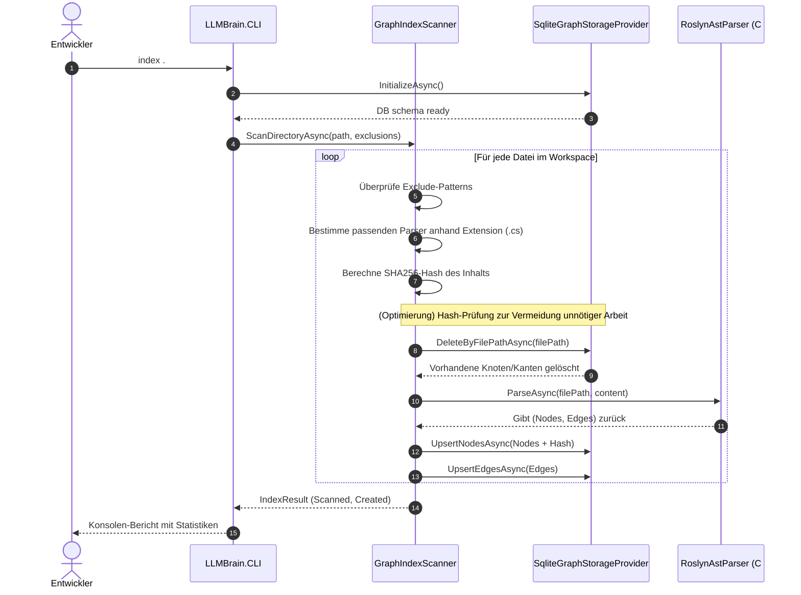
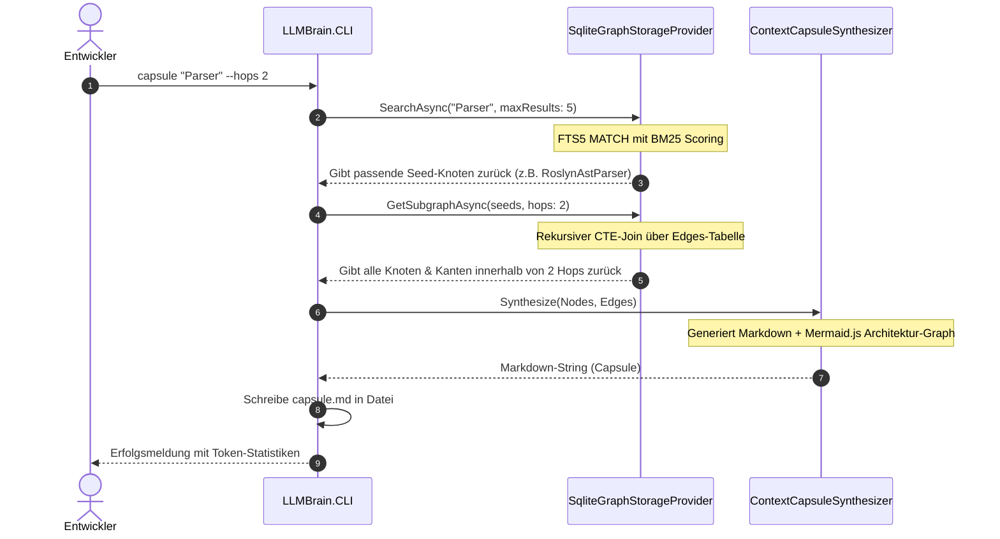

# arc42 Kapitel 6: Laufzeitsicht 🎬

Dieses Kapitel beschreibt das dynamische Verhalten des Systems anhand wesentlicher Szenarien.

---

## 6.1 Szenario 1: Inkrementelle Indexierung

Dieses Szenario zeigt den Ablauf, wenn der Entwickler den Befehl `llmbrain index .` aufruft, um Änderungen in seiner Codebasis in den Graphen einzupflegen.

---

## 6.2 Szenario 2: Kontext-Synthese (Capsule)

Dieses Szenario zeigt den Ablauf, wenn der Entwickler eine Kontextkapsel generiert, um sie an ein LLM zu übergeben.

