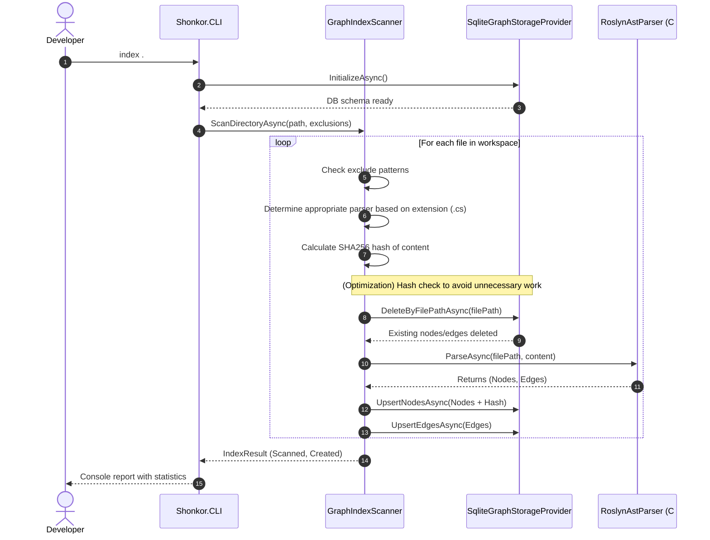
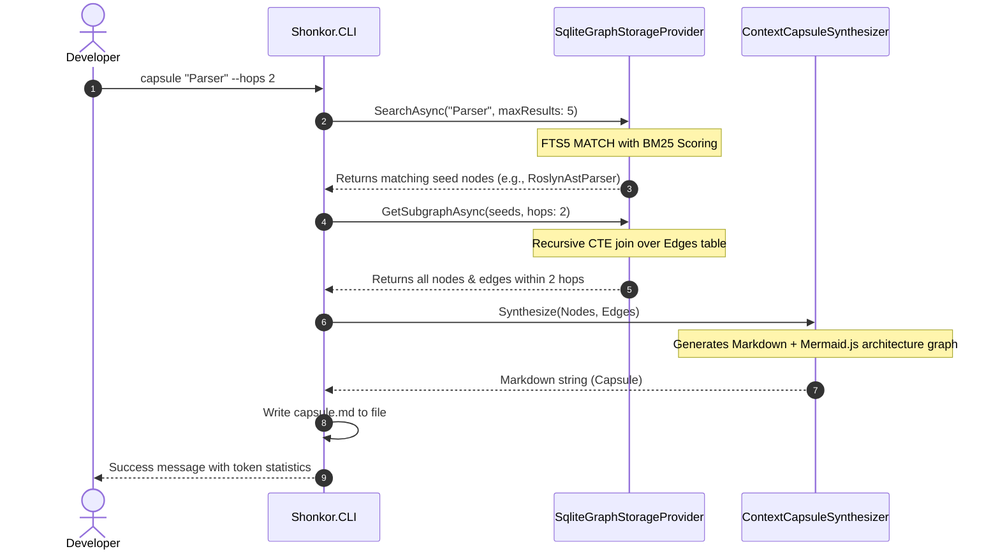

# arc42 Chapter 6: Runtime View 🎬

This chapter describes the dynamic behavior of the system based on essential scenarios.

---

## 6.1 Scenario 1: Incremental Indexing

This scenario illustrates the workflow when the developer invokes the command `shonkor index .` to ingest changes in their codebase into the graph.

---

## 6.2 Scenario 2: Context Synthesis (Capsule)

This scenario illustrates the workflow when the developer generates a context capsule to pass to an LLM.

