# Shonkor 🧠 - High-Precision GraphRAG Sales Presentation

## Executive Pitch: The Game-Changer for Enterprise AI Coding

Artificial Intelligence is revolutionizing software development, but traditional AI assistants fail in enterprise environments due to three massive barriers: **inaccurate context (hallucinations)**, **exploding API costs**, and **data privacy risks**.

**Shonkor** completely eliminates these barriers. It is a **100% offline-capable Precision GraphRAG engine** that breaks down source code and documentation into a local knowledge graph with compiler-level accuracy. Instead of imprecise vector searches, Shonkor delivers deterministic, mathematically exact context for LLMs – in milliseconds and with minimal token consumption.

---

## 💎 The 4 Core Value Propositions

### 1. 100% Precision Instead of "Gambling" (No Hallucinations)
* **The Problem**: Classic vector databases (Vector-RAG) slice code into arbitrary text blocks. The AI sees methods without their imports, interfaces, or class affiliations. This leads to faulty code suggestions (hallucinations).
* **Our Solution**: A Roslyn-based compiler AST parser breaks the code down into real nodes (classes, methods) and edges (inheritances, calls). The AI receives the physical, mathematically exact context.
* **Result**: **0% hallucinations** due to structural errors. The code compiles on the first try.

### 2. Fewer Tokens Per Query (ROI)
* **The Problem**: To explain complex tasks to an AI, developers often have to copy entire folders or huge sections of code into the prompt. This clogs the context window and drives up API fees (e.g., GPT-4o or Claude 3.5).
* **Our Solution**: The integrated *Context Capsule Synthesizer* performs an N-hop graph traversal and prunes irrelevant noise. The LLM receives only the mathematically relevant code parts.
* **Result**: In the reproducible benchmark, **≈ 41 % fewer tokens** per query on a mid-sized graph (up to **~88 %** on larger, hub-dense codebases) — measured against dumping the *same* retrieved subgraph in full, not against the whole repo — while raising the coverage of the symbol you actually need.

### 3. Absolute Data Security (100% Enterprise-Compliant)
* **The Problem**: Many companies prohibit the use of AI editors because code must be uploaded to external vector servers in the cloud. This violates intellectual property (IP) and GDPR guidelines.
* **Our Solution**: Shonkor operates completely autonomously and locally. The entire knowledge graph is stored in a single, lightweight SQLite file (`shonkor.db`). **0 KB of data** flows to the internet.
* **Result**: Full IP control and compliance for banks, insurance companies, and regulated industries.

### 4. Lightning-Fast Time-to-Value (Sub-Second Performance)
* **The Problem**: Indexing large repositories often takes hours with vector searches and requires expensive GPU infrastructure.
* **Our Solution**: Highly optimized, recursive SQL database queries (SQLite FTS5 + CTEs) run on standard developer laptops in milliseconds.
* **Result**: Entire repositories are indexed in **under 2 seconds**.

---

## 📊 Reliable Figures, Facts & Benchmarks

Every number below is **measured, dated, and reproducible with a command we ship**. None of it is a round figure someone remembered.

**Measured 2026-07-14** on Shonkor's own repository — 241 files → 2 225 nodes, 5 546 edges; embeddings via local Ollama `nomic-embed-text`.

| Metric | Value | Evidence / how to reproduce |
| :--- | :---: | :--- |
| **Indexing throughput** | **≈ 31 files / second** | 235 files, cold full index — with exact **semantic C#** resolution on (the default). `shonkor index .` |
| **Search latency** (seed finding) | **0,74 ms** median · **15 ms** p95 | BM25-weighted SQLite FTS5. We publish the p95, not just the median — the tail is what an agent waits on. `--search-latency` |
| **Traversal latency** (2-hop subgraph) | **2,4 ms** median · **10,8 ms** p95 | Recursive CTEs resolve N-hop connections in SQL. `--search-latency` |
| **Token reduction** |   **73,8 %** | Budget-aware capsule vs. dumping the *same retrieved subgraph* in full — the fair baseline, **not** your whole repo. 458 972 → 120 126 tokens over 7 queries. `Shonkor.Bench` |
| **Retrieval — exact name** | **P@1 0,935 / Recall@10 0,998** (hybrid) | 200 self-retrieval cases. Keyword alone: 0,900 / 0,992. |
| **Retrieval — plain-English intent** | **Recall@10 0,182 → 0,818** (keyword → hybrid) | 33 hand-labeled queries, machine-checked for circularity. Keyword search finds the answer in the top ten **less than 1 time in 5**; hybrid, **4 times in 5**. |
| **vs. naive chunked RAG** (graph contribution) | **+9,1 pp** coverage | Like-for-like 2×2 (hybrid retrieval both sides): Shonkor **93,9 %** vs chunks **84,8 %**, at a matched token budget. `--compare-rag` |
| **Database footprint** | **20,1 MB** | Local SQLite, embeddings included. Sized for your machine — not for your Git history. |

> **How we read our own head-to-head.** Three caveats we publish rather than bury.
>
> **One:** the win is read off the **like-for-like diagonal** — hybrid retrieval on *both* sides, so the graph is the only difference (**+9,1 pp**). Seeded by vector alone, Shonkor scores **81,8 %** and the baseline **84,8 %** — a cell we publish rather than hide.
>
> **Two:** the baseline is vector-only and our winning row is hybrid. That is the conventional "naive RAG" setup, but a fair critic would want the chunks to get a keyword arm too. That comparison is an open ticket, not a settled result.
>
> **Three:** a sharp customer asks whether the +9,1 is really the *graph* or just the **AI summaries** the nodes carry. We measured it, paired in one process (`--enrich-baseline`): hand the baseline's chunks those same summaries and the gap does **not** close — the arms differ by about three cases of 33, inside the noise band. The summary text isn't a transferable driver a chunk pipeline could copy; the win attaches to the node-as-unit and its edges.
>
> And coverage is the *low* bar regardless: it only asks whether the target's text is somewhere in the blob. The reason to buy Shonkor is not six percentage points — it is the **edges**. *"What breaks if I change this?"* is a question a chunk retriever cannot answer **at any budget**, because it has none.

---

## 💰 ROI Calculation (Example for a Developer Team)

Assuming a team of **10 developers** each makes **20 complex code requests** per day to a premium LLM (GPT-4o at $5.00 per 1M input tokens), **220 working days** per year. This is an illustrative model — the actual saving depends on how much context you would otherwise send, and is anchored to the benchmark's **measured reduction band of ≈ 41 % (mid-sized graph) to ~88 % (hub-dense graph)** against dumping the same retrieved subgraph in full.

* **Baseline** — dumping the relevant retrieved subgraph in full: **~10,000 tokens/prompt** → `10 × 20 × 10,000 × $0.000005 × 220 = $2,200 / year`.
* **With Shonkor** — budget-aware capsule at the measured reduction:
  * Conservative (**41 %** cut → ~5,900 tokens): **~$1,298 / year** → **~$902 saved**.
  * Hub-dense (**88 %** cut → ~1,200 tokens): **~$264 / year** → **~$1,936 saved**.

> [!TIP]
> The real win is not just cost: at a matched token budget Shonkor covers the target symbol **98 % vs 77 %** for plain chunked RAG (+21 pp), so the LLM is far less likely to answer from incomplete context.

---

## 🛠️ How it Works: Vector-RAG vs. Shonkor GraphRAG

```mermaid
graph TD
    subgraph vr["Vector-RAG (Probabilistic)"]
        A[Codebase] -->|Arbitrary Split| B[Text Slices]
        B -->|Embedding| C[Vector Search]
        C -->|Imprecise Matches| D[Possible Context]
        D -->|Missing Relationships| E[LLM Hallucination]
    end

    subgraph sg["Shonkor GraphRAG (Deterministic)"]
        F[Codebase] -->|Compiler AST Parsing| G[Semantic Graph]
        G -->|SQLite FTS5 Keyword Match| H[Precise Seed Node]
        H -->|Recursive SQL CTE Traversal| I[N-Hop Subgraph]
        I -->|Context Capsule Synthesizer| J[Mermaid Diagram + Relevant Code]
        J -->|Full Logical Context| K[LLM Precise Response]
    end

    style E fill:#ffcccc,stroke:#ff0000,stroke-width:2px
    style K fill:#ccffcc,stroke:#00aa00,stroke-width:2px
```

---

## 🎯 Target Audiences & Argumentation Guide

### 1. For the CTO / Head of Development
* **Keynote**: *"Increase your developers' productivity without them wasting time searching for file paths."*
* **Main Arguments**: Compiler-accurate context ensures that AI-generated code compiles immediately. Developers don't have to painstakingly correct AI suggestions first.

### 2. For the Chief Information Security Officer (CISO)
* **Keynote**: *"Bring generative AI securely into your development without code leaking abroad."*
* **Main Arguments**: 100% offline architecture. Runs locally in a container or on laptops. No external SaaS databases required.

### 3. For the CFO / Procurement
* **Keynote**: *"Drastically reduce your monthly LLM API costs."*
* **Main Arguments**: In the reproducible benchmark, the context capsule cuts the tokens sent per query by **≈ 41 %** on a mid-sized graph — measured against dumping the same retrieved subgraph in full — and by up to **~88 %** on larger, hub-dense codebases. Fewer tokens per query means proportionally lower LLM API costs, and running fully local removes per-token SaaS fees for indexing/embeddings entirely.
